* **Section 1: Introduction**
   - [1. Welcome to course](#1-welcome-to-course)
   - [2. Materials: Delete/destroy all the AWS resources every time you do not use them](#2-materials-deletedestroy-all-the-aws-resources-every-time-you-do-not-use-them)
   - [3. How to start kubernetes cluster on AWS](#3-how-to-start-kubernetes-cluster-on-aws)
   - [4. How to create Hosted Zone on AWS](#4-how-to-create-hosted-zone-on-aws)
   - [5. How to setup communication kops to AWS via aws](#5-how-to-setup-communication-kops-to-aws-via-aws)
   - [6. Materials: How to install KOPS binary](#6-materials-how-to-install-kops-binary)
   - [7. How to install kops](#7-how-to-install-kops)
   - [8. How to create S3 bucket in AWS](#8-how-to-create-s3-bucket-in-aws)
   - [9. Materials: How to install TERRAFORM binary](#9-materials-how-to-install-terraform-binary)
   - [10. How to install Terraform binary](#10-how-to-install-terraform-binary)
   - [11. Materials: How to install KUBECTL binary](#11-materials-how-to-install-kubectl-binary)
   - [12. How to install Kubectl binary](#12-how-to-install-kubectl-binary)
   - [13. Materials: How to start Kubernetes cluster](#13-materials-how-to-start-kubernetes-cluster)
   - [14. How to lunch kubernetes cluster on AWS by using kops and terraform](#14-how-to-lunch-kubernetes-cluster-on-aws-by-using-kops-and-terraform)

* **Section 2: Jupyter Notebooks**
   - [15. Materials: How to run Jupyter Notebooks locally as Docker image](#15-materials-how-to-run-jupyter-notebooks-locally-as-docker-image)
   - [16. How to Jupyter Notebook in Docker on local](#16-how-to-jupyter-notebook-in-docker-on-local)
   - [17. Materials: How to deploy Juypyter Notebooks to Kubernetes via YAML file](#17-materials-how-to-deploy-juypyter-notebooks-to-kubernetes-via-yaml-file)
   - [18. How to deploy Jupyter Notebooks to Kubernetes AWS](#18-how-to-deploy-jupyter-notebooks-to-kubernetes-aws)
   - [19. Explore POD DEPLOYMENT and SERVICE for Jupyter Notebooks](#19-explore-pod-deployment-and-service-for-jupyter-notebooks)

* **Section 3: Introduction to Helm Charts**
  - [20. Install helm v3 and helmfile binaries](#20-install-helm-v3-and-helmfile-binaries)
  - [21. Introduction to Helm charts](#21-introduction-to-helm-charts)
  - [22. Explore example helm chart](#22-explore-example-helm-chart)
  - [23. Deploy Gogs helm chart to a Kubernetes cluster running in AWS](#23-deploy-gogs-helm-chart-to-a-kubernetes-cluster-running-in-aws)
  - [24. Create your own git repository at self-hosted Gogs in your Kubernetes cluster](#24-create-your-own-git-repository-at-self-hosted-gogs-in-your-kubernetes-cluster)
  - [25. Clone your git repository devopsinuse from self-hosted Gogs in your Kubernetes cluster](#25-clone-your-git-repository-devopsinuse-repo-from-self-hosted-gogs-in-your-kubernetes-cluster)
  - [26. Add some content to devopsinuse-repo and git push to your self-hosted Gogs running in Kubernetes](#26-add-some-content-to-devopsinuse-repo-and-git-push-to-your-self-hosted-gogs-running-in-kubernetes)
  - [27. Allow NodePort in AWS Security Group section manually in case you like it more](#27-allow-nodeport-in-aws-security-group-section-manually-in-case-you-like-it-more)
  - [28. MySQL helm chart deployment with Persistent Volume](#28-mysql-helm-chart-deployment-with-persistent-volume)
  - [29. Connect to your MySQL deployment running in your Kubernetes cluster in AWS via an extra ubuntu pod](#29-connect-to-your-mysql-deployment-running-in-your-kubernetes-cluster-in-aws-via-an-extra-ubuntu-pod)
  - [30. Connect to your MySQL deployment running in your Kubernetes cluster in AWS via dbeaver or your favourite GUI program](#30-connect-to-your-mysql-deployment-running-in-your-kubernetes-cluster-in-aws-via-dbeaver-or-your-favourite-gui-program)


### 1. Welcome to course

Please setup **budget** within your Free AWS account to be notified if from some reason AWS is going to charge some fees.

* You can setup Budget in AWS console e.g. `if costs > $2` AWS will send you an email

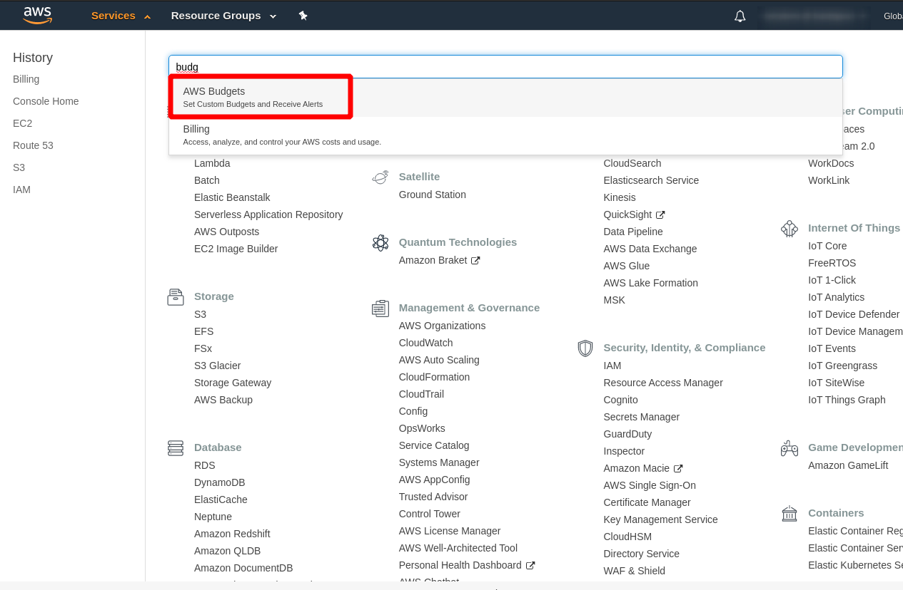

Hit the button **"Create budget"**

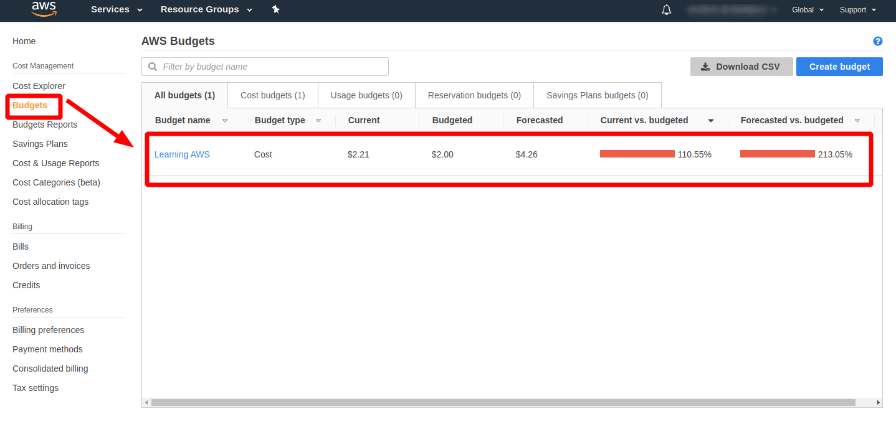

This is an **email I have received** because I keep my **Kubernetes cluster running for 2 days**
and **I am not eligible** for a free AWS account anymore.

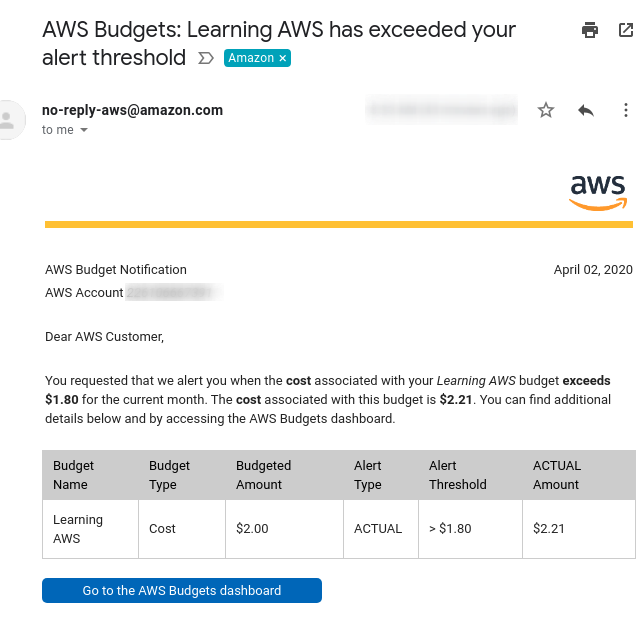


### 2. Materials: Delete/destroy all the AWS resources every time you do not use them

Materials **available**:

https://github.com/xjantoth/helmfile-course/blob/master/Content.md


**Note**: I assume that if you are going through this course during several days - You always **destroy all resources in AWS**  It means that you stop you Kubernetes cluster every time you are not working on it. 

The easiest way is to do it via 
```bash
terraform cd /.../.../.../terraform_code;
terraform destroy # hit yes
```


**destroy/delete manually** if terraform can't do that:
   - VOLUMES
   - LoadBalancer/s (if exists)
   - RecordSet/s (custom RecordSet/s)
   - EC2 instances
   - network resources
   -  ...

 except:
   - **S3 bucket**      (delete once you do not want to use this free 1 YEAR account anymore, or you are done with this course.)
   - **Hosted Zone**   (delete once you do not want to use this free 1 YEAR account anymore, or you are done with this course.)
           


Please do not forget redeploy tiller pod by using of this commands every time you are starting your Kubernetes cluster.

Start your Kubernetes cluster
```bash
cd /.../.../.../terraform_code  
terraform apply 
```

Crete service account && initiate tiller pod in your Kubernetes cluster
```bash
kubectl create serviceaccount --namespace kube-system tiller
kubectl create clusterrolebinding tiller-cluster-rule --clusterrole=cluster-admin --serviceaccount=kube-system:tiller
# kubectl patch deploy --namespace kube-system tiller-deploy -p '{"spec":{"template":{"spec":{"serviceAccount":"tiller"}}}}'
helm init --service-account tiller --upgrade
```

### 3. How to start kubernetes cluster on AWS

* **install** binaries:
   - kops
   - terraform v12
   - awscli
* create **S3 bucket** (unique across entire AWS)
* generate **SSH key** pair
* make sure you got your **own domain name**
* create *hosted zone* in AWS (costs $0.50/month)

```bash
SSH_KEYS=~/.ssh/udemy_devopsinuse

if [ ! -f "$SSH_KEYS" ]
then
   echo -e "\nCreating SSH keys ..."
   ssh-keygen -t rsa -C "udemy.course" -N '' -f $SSH_KEYS
else
   echo -e "\nSSH keys are already in place!"
fi

export AWS_ACCESS_KEY_ID=""
export AWS_SECRET_ACCESS_KEY="..."
export AWS_DEFAULT_REGION="eu-central-1"

echo -e "\nCreating kubernetes cluster ...\n"
 
kops create cluster \
--cloud=aws \
--name=course.devopsinuse.com \
--state=s3://course.devopsinuse.com \
--authorization RBAC \
--zones=eu-central-1a \
--node-count=2 \
--node-size=t2.micro \
--master-size=t2.micro \
--master-count=1 \
--dns-zone=course.devopsinuse.com \
--out=terraform_code \
--target=terraform \
--ssh-public-key=~/.ssh/udemy_devopsinuse.pub

cd terraform_code
terraform init
terraform validate                  # -> thrown me some errors
terraform 0.12upgrade         # <- this command fix some of the errors
terraform validate      
sed -i 's/0-0-0-0--0/kops/g' kubernetes.tf

terraform validate       # -> this time it passed with no errors
terraform plan
```
### 4. How to create Hosted Zone on AWS

* Navigate to your AWS console and search for **Route 53** - then click at *Hosted Zones*
* My "**Hosted zone**" has already been created *course.devopsinuse.com*
* Create your own **Hosted zone** with the **domain name** you own
* Check on your **4 Name Servers**

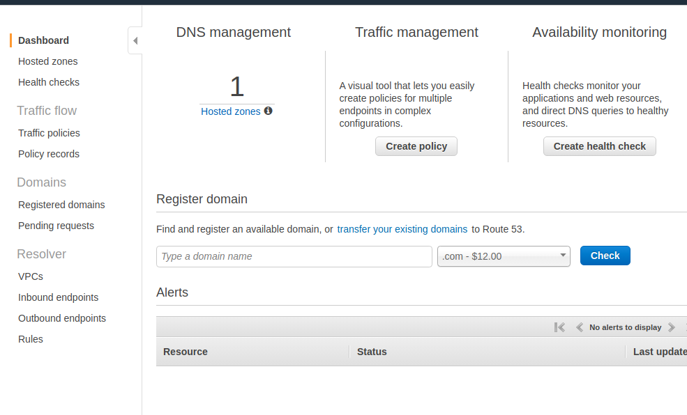

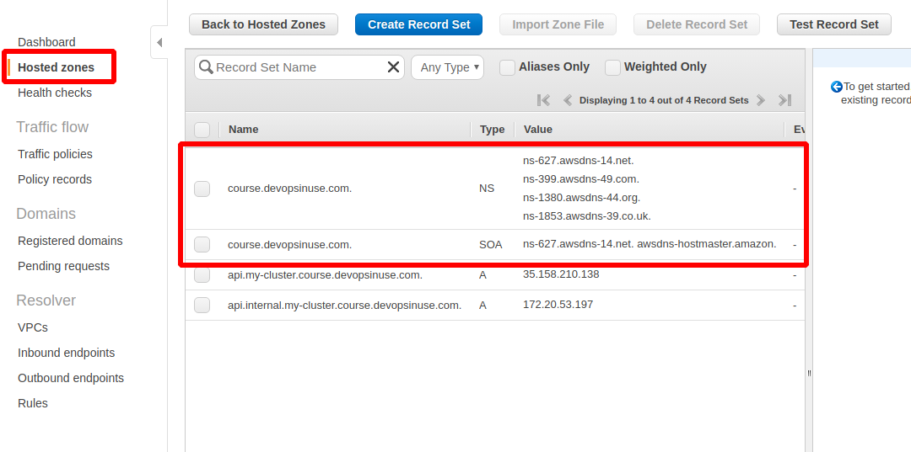

Save all your **nameservers** at the providers web page you either purchased the domain or you got the **free domain from**

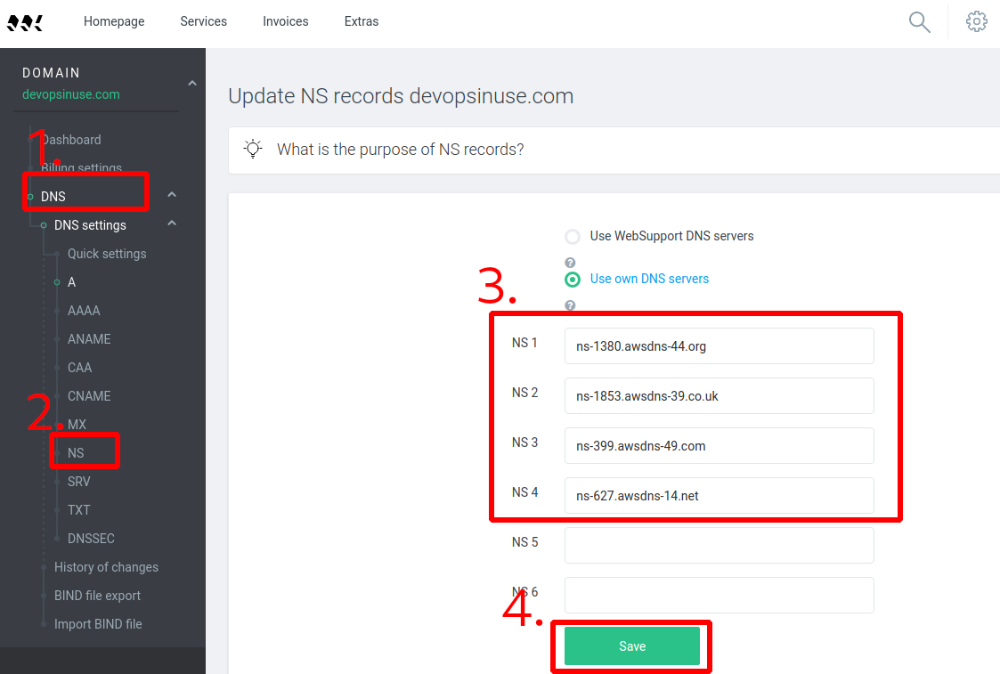

Use `dig` binary to **determine** that your domain and hosted zone is setup correctly

```bash
dig NS course.devopsinuse.com    

; <<>> DiG 9.16.1 <<>> NS course.devopsinuse.com
;; global options: +cmd
;; Got answer:
;; ->>HEADER<<- opcode: QUERY, status: NOERROR, id: 31746
;; flags: qr rd ra; QUERY: 1, ANSWER: 4, AUTHORITY: 0, ADDITIONAL: 0

;; QUESTION SECTION:
;course.devopsinuse.com.		IN	NS

;; ANSWER SECTION:
course.devopsinuse.com.	172800	IN	NS	ns-1380.awsdns-44.org.
course.devopsinuse.com.	172800	IN	NS	ns-1853.awsdns-39.co.uk.
course.devopsinuse.com.	172800	IN	NS	ns-399.awsdns-49.com.
course.devopsinuse.com.	172800	IN	NS	ns-627.awsdns-14.net.

;; Query time: 203 msec
;; SERVER: 192.168.1.1#53(192.168.1.1)
...
;; MSG SIZE  rcvd: 177

```

### 5. How to setup communication kops to AWS via aws

* Install `awscli` binary 
   * https://docs.aws.amazon.com/cli/latest/userguide/install-linux-al2017.html
* Please configure these two files
   * ~/.aws/credentials
   * ~/.aws/config

Search for **IAM** expression in Free AWS account


Add **User** if you do not have one
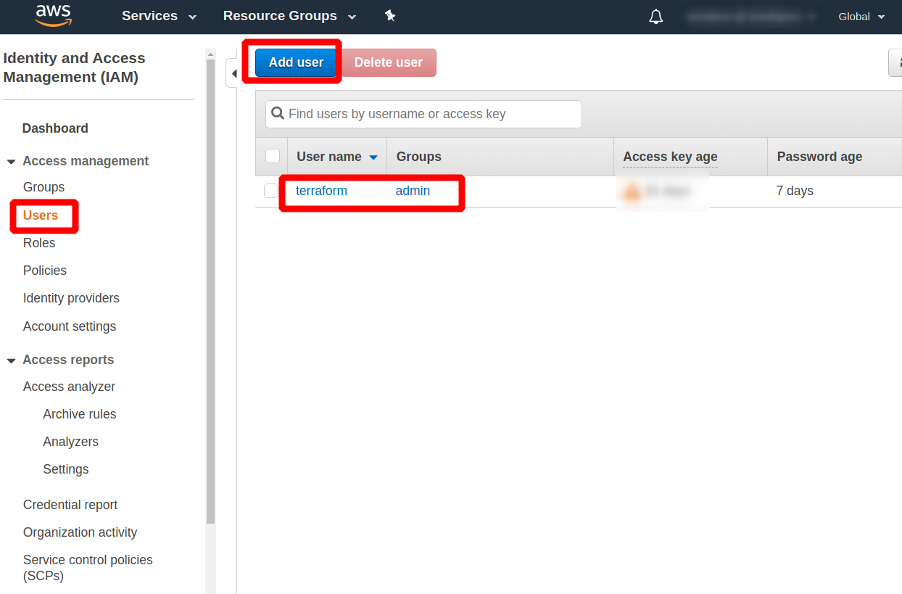

Click at a newly created **User** and search for **Security credentials** and **Create access key** section
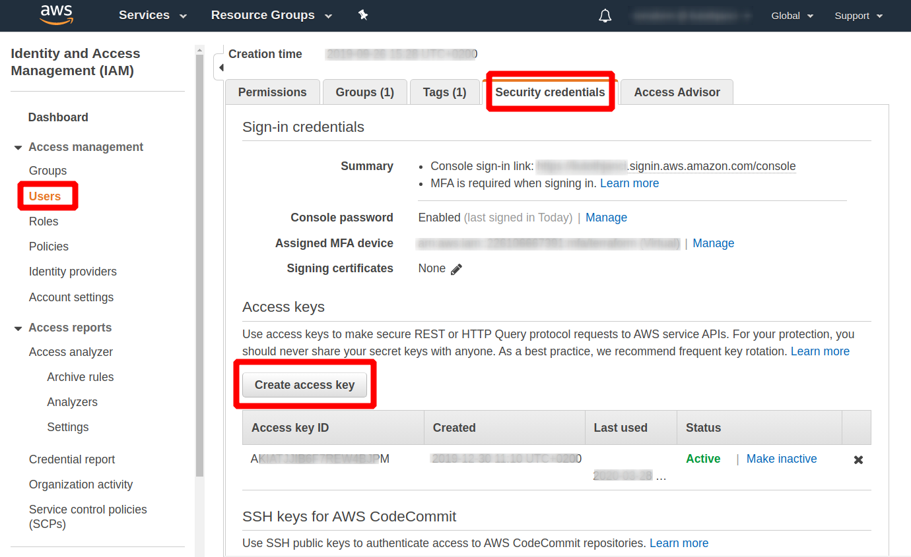

```bash
vim  ~/.aws/credentials
[terraform]
aws_access_key_id = ...
aws_secret_access_key = ...
```

```bash         
vim ~/.aws/config
[profile terraform]
region=eu-central-1
```

### 6. Materials: How to install KOPS binary

Navigate to: https://github.com/kubernetes/kops/releases/tag/v1.16.0

```bash
sudo curl \
-L --output /usr/bin/kops  \
https://github.com/kubernetes/kops/releases/download/v1.16.0/kops-linux-amd64 && sudo chmod +x /usr/bin/kops
```

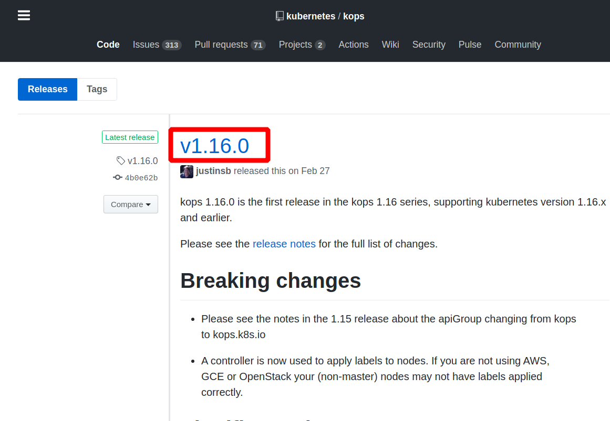
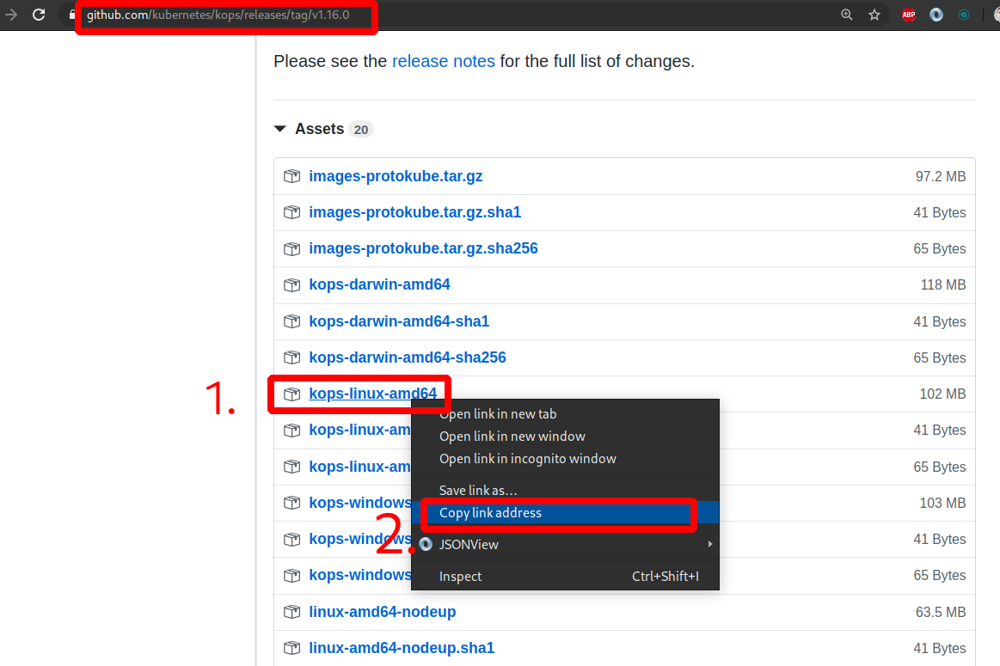


### 7. How to install kops 
All `kops` releases: https://github.com/kubernetes/kops/releases/ 

Navigate to: https://github.com/kubernetes/kops/releases/tag/v1.16.0

```bash
which kops

sudo curl \
-L --output /usr/bin/kops  \
https://github.com/kubernetes/kops/releases/download/v1.16.0/kops-linux-amd64 && sudo chmod +x /usr/bin/kops
```


### 8. How to create S3 bucket in AWS

```bash
# create a new bucket
aws s3 mb s3://example.devopsinuse.com --profile terraform
make_bucket: example.devopsinuse.com

# list all buckets
aws s3 ls --profile terraform                            
2018-07-06 12:26:00 course.devopsinuse.com
2020-03-31 15:23:14 example.devopsinuse.com

# remove bucket
aws s3 rb s3://example.devopsinuse.com --profile terraform
remove_bucket: example.devopsinuse.com
```

**Search** for the expression **"S3"** in AWS console

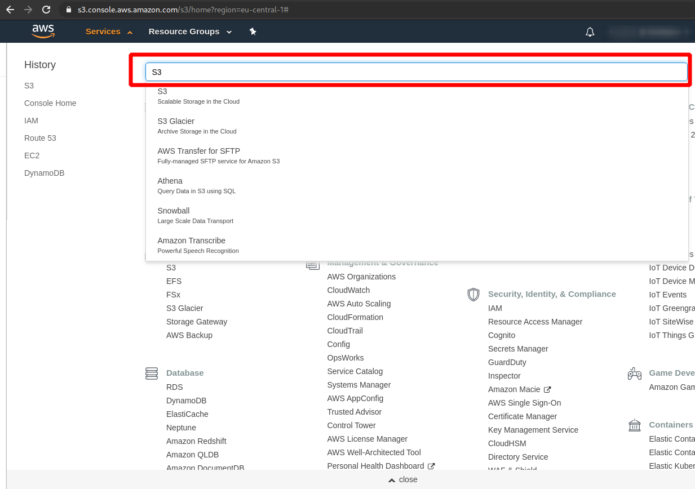

**Create** a new S3 bucket if you do not have one
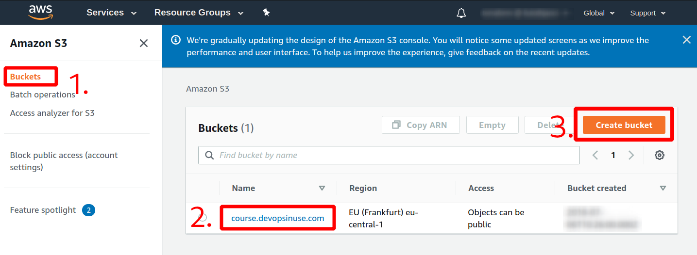

**Fill up** neceassary details

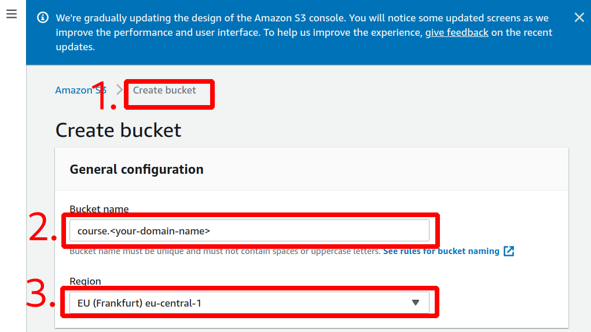

Hit button **Create bucket**
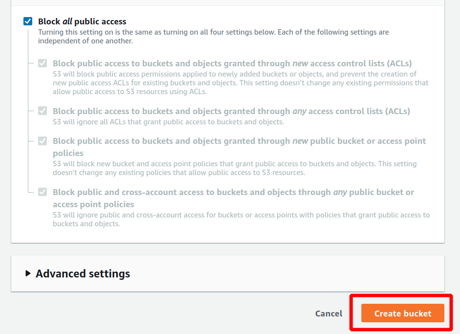

### 9. Materials: How to install TERRAFORM binary

https://www.terraform.io/downloads.html

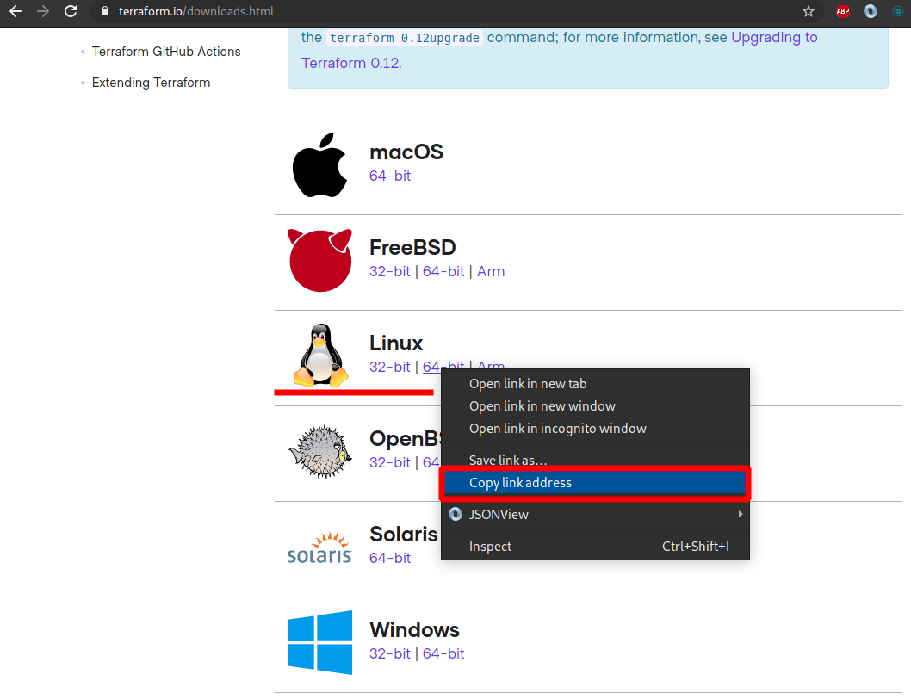

```bash
curl -L --output /tmp/terraform.zip  \
https://releases.hashicorp.com/terraform/0.12.24/terraform_0.12.24_linux_amd64.zip

sudo unzip -d /usr/bin/ /tmp/terraform.zip 

terraform -version
Terraform v0.12.24

```

### 10. How to install Terraform binary
https://www.terraform.io/downloads.html


```bash
curl -L --output /tmp/terraform.zip  \
https://releases.hashicorp.com/terraform/0.12.24/terraform_0.12.24_linux_amd64.zip

sudo unzip -d /usr/bin/ /tmp/terraform.zip 

terraform -version
Terraform v0.12.24
```

### 11. Materials: How to install KUBECTL binary
Link: https://kubernetes.io/docs/tasks/tools/install-kubectl/

```bash
curl -LO https://storage.googleapis.com/kubernetes-release/release/v1.18.0/bin/linux/amd64/kubectl
chmod +x ./kubectl
sudo mv ./kubectl /usr/local/bin/kubectl
kubectl version --client
```         


### 12. How to install Kubectl binary
Link: https://kubernetes.io/docs/tasks/tools/install-kubectl/

```bash
curl -LO https://storage.googleapis.com/kubernetes-release/release/v1.18.0/bin/linux/amd64/kubectl
chmod +x ./kubectl
sudo mv ./kubectl /usr/local/bin/kubectl
kubectl version --client
```         


### 13. Materials: How to start Kubernetes cluster

**Generate** SSH key pair:
```bash
SSH_KEYS=~/.ssh/udemy_devopsinuse

if [ ! -f "$SSH_KEYS" ]
then
   echo -e "\nCreating SSH keys ..."
   ssh-keygen -t rsa -C "udemy.course" -N '' -f $SSH_KEYS
else
   echo -e "\nSSH keys are already in place!"
fi
```

Export environmental variables for ***kops***, ***awscli*** and ***terraform*** binaries:
* **AWS_ACCESS_KEY_ID**
* **AWS_SECRET_ACCESS_KEY** 
* **AWS_DEFAULT_REGION** 

```bash
export AWS_ACCESS_KEY_ID="..."
export AWS_SECRET_ACCESS_KEY="..."
export AWS_DEFAULT_REGION="eu-central-1"

env | grep AWS | sed -E  's/^(.*=)(.*)$/\1masked-output/'
```

**Generate** *terraform code* by executing following *kops command* to provision Kubernetes cluster in **AWS**:

```bash
kops create cluster \
--cloud=aws \
--name=course.devopsinuse.com \
--state=s3://course.devopsinuse.com \
--authorization RBAC \
--zones=eu-central-1a \
--node-count=2 \
--node-size=t2.micro \
--master-size=t2.micro \
--master-count=1 \
--dns-zone=course.devopsinuse.com \
--out=terraform_code \
--target=terraform \
--ssh-public-key=~/.ssh/udemy_devopsinuse.pub

cd terraform_code
terraform init
terraform validate            # -> thrown me some errors
terraform 0.12upgrade         # <- this command fix some of the errors
terraform validate      
sed -i 's/0-0-0-0--0/kops/g' kubernetes.tf

terraform validate            # -> this time it passed with no errors
terraform plan

```

Pleas run *terrafrom apply* command to provision Kubernetes cluster in **AWS**:
```bash
terraform apply
```
Please wait like _~10 miutes_ not to get upset that **DNS records** are not being created very fast

!!! This section is only applicable if you want to use **helm v2** 
Install **helm v2**
```bash
curl -L --output /tmp/helm-v2.16.5-linux-amd64.tar.gz  https://get.helm.sh/helm-v2.16.5-linux-amd64.tar.gz
sudo tar -xvf /tmp/helm-v2.16.5-linux-amd64.tar.gz --strip-components=1 -C /usr/bin/ linux-amd64/helm
sudo chmod +x /usr/bin/helm
```

!!! This section is only applicable if you want to use **helm v2** 
```bash
helm version 
kubectl create serviceaccount --namespace kube-system tiller
kubectl create clusterrolebinding tiller-cluster-rule --clusterrole=cluster-admin --serviceaccount=kube-system:tiller
helm init --service-account tiller --upgrade
helm ls
```

**Destroy** your Kubernetes cluster
```bash
cd terraform_code
terraform destroy
```

### 14. How to lunch kubernetes cluster on AWS by using kops and terraform
**Generate** SSH key pair:
```bash
SSH_KEYS=~/.ssh/udemy_devopsinuse

if [ ! -f "$SSH_KEYS" ]
then
   echo -e "\nCreating SSH keys ..."
   ssh-keygen -t rsa -C "udemy.course" -N '' -f $SSH_KEYS
else
   echo -e "\nSSH keys are already in place!"
fi
```

Export environmental variables for ***kops***, ***awscli*** and ***terraform*** binaries:
* **AWS_ACCESS_KEY_ID**
* **AWS_SECRET_ACCESS_KEY** 
* **AWS_DEFAULT_REGION** 

```bash
export AWS_ACCESS_KEY_ID="..."
export AWS_SECRET_ACCESS_KEY="..."
export AWS_DEFAULT_REGION="eu-central-1"

# I do not want to make my credential public and be visible in video
env | grep AWS | sed -E  's/^(.*=)(.*)$/\1masked-output/'
```

**Generate** *terraform code* by executing following *kops command* to provision Kubernetes cluster in **AWS**:

```bash
kops create cluster \
--cloud=aws \
--name=course.devopsinuse.com \
--state=s3://course.devopsinuse.com \
--authorization RBAC \
--zones=eu-central-1a \
--node-count=2 \
--node-size=t2.micro \
--master-size=t2.micro \
--master-count=1 \
--dns-zone=course.devopsinuse.com \
--out=terraform_code \
--target=terraform \
--ssh-public-key=~/.ssh/udemy_devopsinuse.pub

cd terraform_code
terraform init
terraform validate            # -> thrown me some errors
terraform 0.12upgrade         # <- this command fix some of the errors
terraform validate      
sed -i 's/0-0-0-0--0/kops/g' kubernetes.tf

terraform validate            # -> this time it passed with no errors
terraform plan

```

Pleas run *terrafrom apply* command to provision Kubernetes cluster in **AWS**:
```bash
terraform apply
```
Please wait like _~10 miutes_ not to get upset that **DNS records** are not being created very fast


!!! This section is only applicable if you want to use **helm v2** 
Install **helm v2**
```bash
curl -L --output /tmp/helm-v2.16.5-linux-amd64.tar.gz  https://get.helm.sh/helm-v2.16.5-linux-amd64.tar.gz
sudo tar -xvf /tmp/helm-v2.16.5-linux-amd64.tar.gz --strip-components=1 -C /usr/bin/ linux-amd64/helm
sudo chmod +x /usr/bin/helm
```

!!! This section is only applicable if you want to use **helm v2** 
```bash
helm version 
kubectl create serviceaccount --namespace kube-system tiller
kubectl create clusterrolebinding tiller-cluster-rule --clusterrole=cluster-admin --serviceaccount=kube-system:tiller
helm init --service-account tiller --upgrade
helm ls
```

**Destroy** your Kubernetes cluster
```bash
cd terraform_code
terraform destroy
```


### 15. Materials: How to run Jupyter Notebooks locally as Docker image
```bash
docker ps
docker run \
--name djupyter  \
-p 8888:8888 \
-d jupyter/scipy-notebook:2c80cf3537ca

6f1d5c03efced84f7e9502649c1618e8304f304a69ce3f6100d2ef11111 
 
docker logs 6f1d5c03efced84f7e9502649c1618e8304f304a69ce3f6100d2ef11111 -f
```

### 16. How to Jupyter Notebook in Docker on local

**Start** Jupyter Notebook locally as **docker image**:
```bash
docker ps

docker run \
--name djupyter  \
-p 8888:8888 \
-d jupyter/scipy-notebook:2c80cf3537ca

6f1d5c03efced84f7e9502649c1618e8304f304a69ce3f6100d2ef11111 
 
docker logs 6f1d5c03efced84f7e9502649c1618e8304f304a69ce3f6100d2ef11111 -f
...
...
    Copy/paste this URL into your browser when you connect for the first time,
    to login with a token:
        http://localhost:8888/?token=<some_long_token>
...
...
docker stop djupyter
```
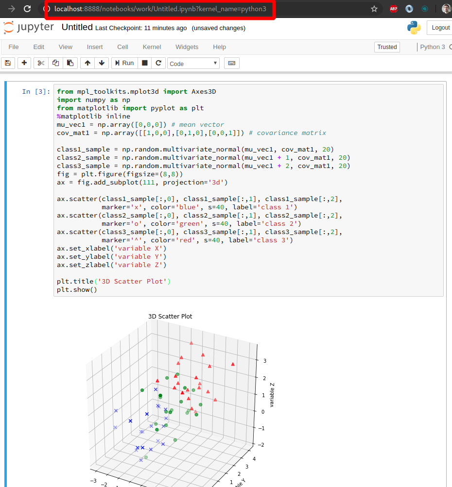

**Copy and paste** this code snippet to your **Jupyter Notebook** in the web browser:

```python
from mpl_toolkits.mplot3d import Axes3D
import numpy as np
from matplotlib import pyplot as plt
%matplotlib inline
mu_vec1 = np.array([0,0,0]) # mean vector
cov_mat1 = np.array([[1,0,0],[0,1,0],[0,0,1]]) # covariance matrix

class1_sample = np.random.multivariate_normal(mu_vec1, cov_mat1, 20)
class2_sample = np.random.multivariate_normal(mu_vec1 + 1, cov_mat1, 20)
class3_sample = np.random.multivariate_normal(mu_vec1 + 2, cov_mat1, 20)
fig = plt.figure(figsize=(8,8))
ax = fig.add_subplot(111, projection='3d')
   
ax.scatter(class1_sample[:,0], class1_sample[:,1], class1_sample[:,2], 
           marker='x', color='blue', s=40, label='class 1')
ax.scatter(class2_sample[:,0], class2_sample[:,1], class2_sample[:,2], 
           marker='o', color='green', s=40, label='class 2')
ax.scatter(class3_sample[:,0], class3_sample[:,1], class3_sample[:,2], 
           marker='^', color='red', s=40, label='class 3')
ax.set_xlabel('variable X')
ax.set_ylabel('variable Y')
ax.set_zlabel('variable Z')

plt.title('3D Scatter Plot')
plt.show()
```         

### 17. Materials: How to deploy Juypyter Notebooks to Kubernetes via YAML file

Execute _kubernetes deployment_ **file**: 
```bash
kubectl create -f jupyter-notebook-deployment.yaml
```
File: https://github.com/xjantoth/helmfile-course/blob/master/jupyter-notebook-deployment.yaml

```yaml
---
apiVersion: apps/v1
kind: Deployment
metadata:
  name: jupyter-k8s-udemy
  labels:
    app: jupyter-k8s-udemy
spec:
  replicas: 1
  selector:
    matchLabels:
      app: jupyter-k8s-udemy
  template:
    metadata:
      labels:
        app: jupyter-k8s-udemy
    spec:
      containers:
      - name: minimal-notebook
        image: jupyter/scipy-notebook:2c80cf3537ca
        ports:
        - containerPort: 8888
        command: ["start-notebook.sh"]
        args: ["--NotebookApp.token=''"]
```

Execute _kubernetes service_ **file**: 
```bash
kubectl create -f jupyter-notebook-service.yaml
```
File: https://github.com/xjantoth/helmfile-course/blob/master/jupyter-notebook-service.yaml

```yaml
---
kind: Service
apiVersion: v1
metadata:
  name: jupyter-k8s-udemy
spec:
  type: NodePort
  selector:
    app: jupyter-k8s-udemy
  ports:
  - protocol: TCP
    nodePort: 30040
    port: 8888
    targetPort: 8888
```          

```bash
kubectl get nodes -o wide | awk -F" " '{print $1"\t"$7}'

NAME	EXTERNAL-IP
ip-172-20-34-241.eu-central-1.compute.internal	18.184.212.193
ip-172-20-50-50.eu-central-1.compute.internal	3.120.179.150
ip-172-20-52-232.eu-central-1.compute.internal	18.196.157.47
```

**SSH to your** AWS EC2 instances if neceassary
```bash
ssh -i ~/.ssh/udemy_devopsinuse admin@18.184.212.193
ssh -i ~/.ssh/udemy_devopsinuse admin@3.120.179.150
ssh -i ~/.ssh/udemy_devopsinuse admin@18.196.157.47
```

**Run command** `netstat -tunlp | grep 30040` at each of the EC2 instances
to see that **NodePort** type of ***kubernetes service*** results in exposing this port at each 
physical EC2 within your Kubernetes cluster in AWS

```bash
ssh -i ~/.ssh/udemy_devopsinuse admin@18.184.212.193  netstat -tunlp | grep 30040
ssh -i ~/.ssh/udemy_devopsinuse admin@3.120.179.150   netstat -tunlp | grep 30040
ssh -i ~/.ssh/udemy_devopsinuse admin@18.196.157.47   netstat -tunlp | grep 30040
```
### 18. How to deploy Jupyter Notebooks to Kubernetes AWS

Execute _kubernetes deployment_ **file**: 
```bash
kubectl create -f jupyter-notebook-deployment.yaml
```
File: https://github.com/xjantoth/helmfile-course/blob/master/jupyter-notebook-deployment.yaml

```yaml
---
apiVersion: apps/v1
kind: Deployment
metadata:
  name: jupyter-k8s-udemy
  labels:
    app: jupyter-k8s-udemy
spec:
  replicas: 1
  selector:
    matchLabels:
      app: jupyter-k8s-udemy
  template:
    metadata:
      labels:
        app: jupyter-k8s-udemy
    spec:
      containers:
      - name: minimal-notebook
        image: jupyter/scipy-notebook:2c80cf3537ca
        ports:
        - containerPort: 8888
        command: ["start-notebook.sh"]
        args: ["--NotebookApp.token=''"]
```


Execute _kubernetes service_ **file**: 
```bash
kubectl create -f jupyter-notebook-service.yaml
```
File: https://github.com/xjantoth/helmfile-course/blob/master/jupyter-notebook-service.yaml

```yaml
---
kind: Service
apiVersion: v1
metadata:
  name: jupyter-k8s-udemy
spec:
  type: NodePort
  selector:
    app: jupyter-k8s-udemy
  ports:
  - protocol: TCP
    nodePort: 30040
    port: 8888
    targetPort: 8888
```          


**Reminder:** how to run Jupyter Notebooks at your local laptop as a single dokcer container
```bash
docker run \
--name djupyter  \
-p 8888:8888 \
-d jupyter/scipy-notebook:2c80cf3537ca
```
**Execute** deployment for Jupyter Notebooks in your Kubernetes cluster in AWS
```bash
kubectl apply -f jupyter-notebook-deployment.yaml
kubectl apply -f jupyter-notebook-service.yaml
```

Check for the status of **pods** and **services**
```bash
kubectl get pods,svc
NAME                                     READY   STATUS    RESTARTS   AGE
pod/jupyter-k8s-udemy-5686d7b74f-qgj5x   1/1     Running   0          62s

NAME                        TYPE        CLUSTER-IP       EXTERNAL-IP   PORT(S)          AGE
service/jupyter-k8s-udemy   NodePort    100.67.171.238   <none>        8888:30040/TCP   57s
service/kubernetes          ClusterIP   100.64.0.1       <none>        443/TCP          8h
```

Make sure to allow **Security group** for Kubernetes Node

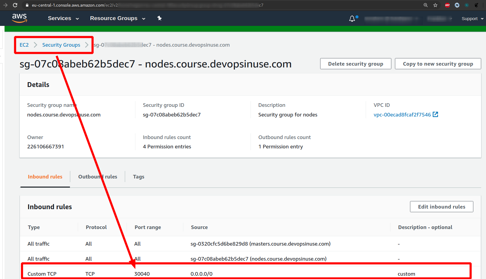

**Retrive** the IP addresses of your physical EC2 instances (servers) in AWS
```bash
kubectl get nodes -o wide | awk -F" " '{print $3"\t"$1"\t"$7}'
ROLES	NAME	EXTERNAL-IP
master	ip-172-20-34-241.eu-central-1.compute.internal	18.184.212.193
node	ip-172-20-50-50.eu-central-1.compute.internal	3.120.179.150
node	ip-172-20-52-232.eu-central-1.compute.internal	18.196.157.47
```

**Navigate** to you favourite web browser and hit either
```bash
http://3.120.179.150:30040      # for node #1
http://18.196.157.47:30040      # for node #2
```

**Copy and paste** this code snippet to your Jupyter Notebook **in the web browser**:

```python
from mpl_toolkits.mplot3d import Axes3D
import numpy as np
from matplotlib import pyplot as plt
%matplotlib inline
mu_vec1 = np.array([0,0,0]) # mean vector
cov_mat1 = np.array([[1,0,0],[0,1,0],[0,0,1]]) # covariance matrix

class1_sample = np.random.multivariate_normal(mu_vec1, cov_mat1, 20)
class2_sample = np.random.multivariate_normal(mu_vec1 + 1, cov_mat1, 20)
class3_sample = np.random.multivariate_normal(mu_vec1 + 2, cov_mat1, 20)
fig = plt.figure(figsize=(8,8))
ax = fig.add_subplot(111, projection='3d')
   
ax.scatter(class1_sample[:,0], class1_sample[:,1], class1_sample[:,2], 
           marker='x', color='blue', s=40, label='class 1')
ax.scatter(class2_sample[:,0], class2_sample[:,1], class2_sample[:,2], 
           marker='o', color='green', s=40, label='class 2')
ax.scatter(class3_sample[:,0], class3_sample[:,1], class3_sample[:,2], 
           marker='^', color='red', s=40, label='class 3')
ax.set_xlabel('variable X')
ax.set_ylabel('variable Y')
ax.set_zlabel('variable Z')

plt.title('3D Scatter Plot')
plt.show()
```


**Determine** the IP addresses/names/roles of your physical EC2 instances (servers) in AWS
```bash
kubectl get nodes -o wide | awk -F" " '{print $3"\t"$1"\t"$7}'
ROLES	NAME	EXTERNAL-IP
master	ip-172-20-34-241.eu-central-1.compute.internal	18.184.212.193
node	ip-172-20-50-50.eu-central-1.compute.internal	3.120.179.150
node	ip-172-20-52-232.eu-central-1.compute.internal	18.196.157.47
```

**SSH to your** AWS EC2 instances if neceassary
```bash
ssh -i ~/.ssh/udemy_devopsinuse admin@18.184.212.193
ssh -i ~/.ssh/udemy_devopsinuse admin@3.120.179.150
ssh -i ~/.ssh/udemy_devopsinuse admin@18.196.157.47
```

**Run command** `netstat -tunlp | grep 30040` at each of the EC2 instances
to see that **NodePort** type of ***kubernetes service*** results in exposing this port at each 
physical EC2 within your Kubernetes cluster in AWS

```bash
ssh -i ~/.ssh/udemy_devopsinuse admin@18.184.212.193  netstat -tunlp | grep 30040
ssh -i ~/.ssh/udemy_devopsinuse admin@3.120.179.150   netstat -tunlp | grep 30040
ssh -i ~/.ssh/udemy_devopsinuse admin@18.196.157.47   netstat -tunlp | grep 30040
```

**Destroy** deployment, service for Jupyter Notebooks for your Kubernetes cluster in AWS
```bash
kubectl delete -f jupyter-notebook-deployment.yaml
kubectl delete -f jupyter-notebook-service.yaml
```

### 19. Explore POD DEPLOYMENT and SERVICE for Jupyter Notebooks

**Deploy** deployment, service for Jupyter Notebooks for your Kubernetes cluster in AWS
```bash
kubectl apply -f jupyter-notebook-deployment.yaml
kubectl apply -f jupyter-notebook-service.yaml
```


Useful commands for **pods kubernetes** object

```yaml
---
# Describe pod 
kubectl describe pod $(kubectl get pods | cut -d' ' -f1 | grep -v "NAME")

# Edit pod 
kubectl edit pod $(kubectl get pods | cut -d' ' -f1 | grep -v "NAME")

# Check for pods logs
kubectl logs -f  $(kubectl get pods | cut -d' ' -f1 | grep -v "NAME") 

Executing the command: jupyter notebook --NotebookApp.token=''
[I 19:40:56.558 NotebookApp] Writing notebook server cookie secret to /home/jovyan/.local/share/jupyter/runtime/notebook_cookie_secret
[W 19:40:56.966 Notebook
...

```

Useful commands for **deployment kubernetes** object
```bash
kubectl get deployment -A 

kubectl describe deployment   $(kubectl get deployment | cut -d' ' -f1 | grep -v "NAME") 
Name:                   jupyter-k8s-udemy
Namespace:              default
CreationTimestamp:      Wed, 01 Apr 2020 21:40:54 +0200
Labels:                 app=jupyter-k8s-udemy
Annotations:            deployment.kubernetes.io/revision: 1
Selector:               app=jupyter-k8s-udemy
Replicas:               1 desired | 1 updated | 1 total | 1 available | 0 unavailable
StrategyType:           RollingUpdate
MinReadySeconds:        0
RollingUpdateStrategy:  25% max unavailable, 25% max surge
Pod Template:
  Labels:  app=jupyter-k8s-udemy
  Containers:
   minimal-notebo...
```

File: https://github.com/xjantoth/helmfile-course/blob/master/jupyter-notebook-deployment.yaml

```yaml
---
apiVersion: apps/v1
kind: Deployment
metadata:
  name: jupyter-k8s-udemy
  labels:
    app: jupyter-k8s-udemy
spec:
  replicas: 1
  selector:
    matchLabels:
      app: jupyter-k8s-udemy
  template:
    metadata:
      labels:
        app: jupyter-k8s-udemy
    spec:
      containers:
      - name: minimal-notebook
        image: jupyter/scipy-notebook:2c80cf3537ca
        ports:
        - containerPort: 8888
        command: ["start-notebook.sh"]
        args: ["--NotebookApp.token=''"]
```


Useful commands for **service kubernetes** object
```bash
kubectl get svc
kubectl get svc -A
kubectl edit svc <service-name>
EDITOR=vim kubectl edit svc <service-name>
```

Describe **service kubernetes** object
```bash
kubectl describe svc $(kubectl get svc | grep jupyt | cut -d' ' -f1 )
Name:                     jupyter-k8s-udemy
Namespace:                default
Labels:                   <none>
Annotations:              Selector:  app=jupyter-k8s-udemy
Type:                     NodePort
IP:                       100.65.51.245
Port:                     <unset>  8888/TCP
TargetPort:               8888/TCP
NodePort:                 <unset>  30040/TCP
Endpoints:                100.96.2.5:8888
Session Affinity:         None
External Traffic Policy:  Cluster
Events:                   <none>
```

File: https://github.com/xjantoth/helmfile-course/blob/master/jupyter-notebook-service.yaml

```yaml
---
kind: Service
apiVersion: v1
metadata:
  name: jupyter-k8s-udemy
spec:
  type: NodePort
  selector:
    app: jupyter-k8s-udemy
  ports:
  - protocol: TCP
    nodePort: 30040
    port: 8888
    targetPort: 8888
```          


<!-- section helm charts -->

### 20. Install helm v3 and helmfile binaries
**Install** helm v3
```bash
curl --output /tmp/helm-v3.1.1-linux-amd64.tar.gz -L https://get.helm.sh/helm-v3.1.1-linux-amd64.tar.gz
sudo tar -xvf /tmp/helm-v3.1.1-linux-amd64.tar.gz --strip-components=1 -C /usr/local/bin/ linux-amd64/helm
sudo mv /usr/local/bin/helm /usr/local/bin/helm3
sudo chmod +x /usr/local/bin/helm3

# In case you have no helm chart repository added
helm3 repo add stable https://kubernetes-charts.storage.googleapis.com/
```

**Verify** your helm chart repository repo helm v3
```bash
helm3 repo update
helm3 repo list
```

Install **helmfile**
```bash
sudo curl -L --output /usr/bin/helmfile https://github.com/roboll/helmfile/releases/download/v0.104.0/helmfile_linux_amd64
sudo chmod +x /usr/bin/helmfile

# Create symbolic link from helm3 to helm
ln -s /usr/local/bin/helm3 /usr/bin/helm
```

**!!!** This section is only applicable if you want to use **helm v2**
Install helm v2
```bash
curl -L --output /tmp/helm-v2.16.5-linux-amd64.tar.gz  https://get.helm.sh/helm-v2.16.5-linux-amd64.tar.gz
sudo tar -xvf /tmp/helm-v2.16.5-linux-amd64.tar.gz --strip-components=1 -C /usr/bin/ linux-amd64/helm
sudo chmod +x /usr/bin/helm
```

**!!!** This section is only applicable if you want to use **helm v2**

```bash
helm version 
kubectl create serviceaccount --namespace kube-system tiller
kubectl create clusterrolebinding tiller-cluster-rule --clusterrole=cluster-admin --serviceaccount=kube-system:tiller
helm init --service-account tiller --upgrade
helm ls
```
### 21. Introduction to Helm charts

**Create** your first **helm chart** named `example`
Keep in mind that by default when running `helm3 create <chart-name>`
the helm chart will use **Nginx docker container** and I will use it in this `example` helm chart.


We will then **add** an extra template called:
`example/templates/configmapIndexHTML.yaml` 
and replace the content of a default **index.html** file in web root for **Nginx** (`/usr/share/nginx/html/index.html`).


```bash
cd helm-charts
helm3 create <name-of-helmchart>
helm3 create example
```

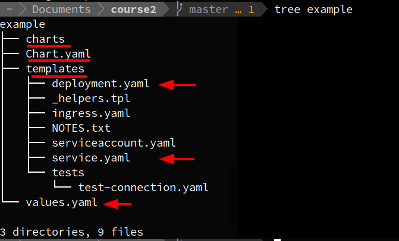

Explore Chart.yaml file
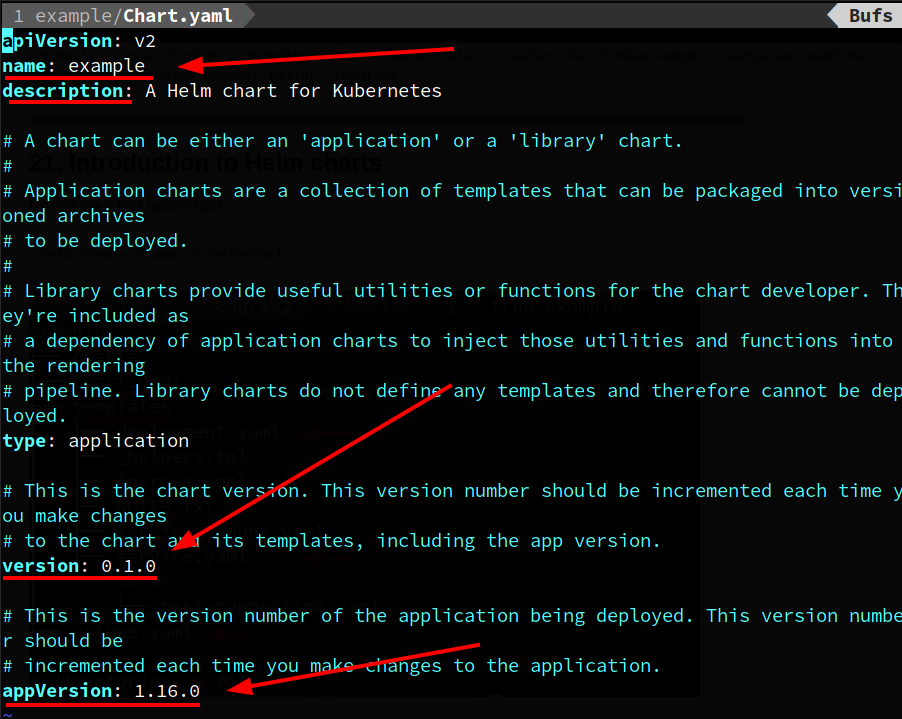

Determine the **docker image** by using `jq` binary
```bash
kubectl get  pod example-5664d55c58-6kdd2 -o json | jq .spec.containers  | jq '.[].image'
```

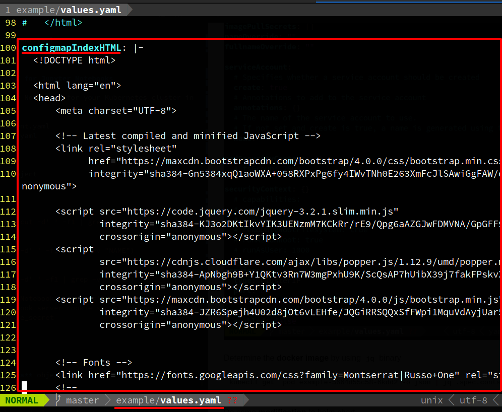


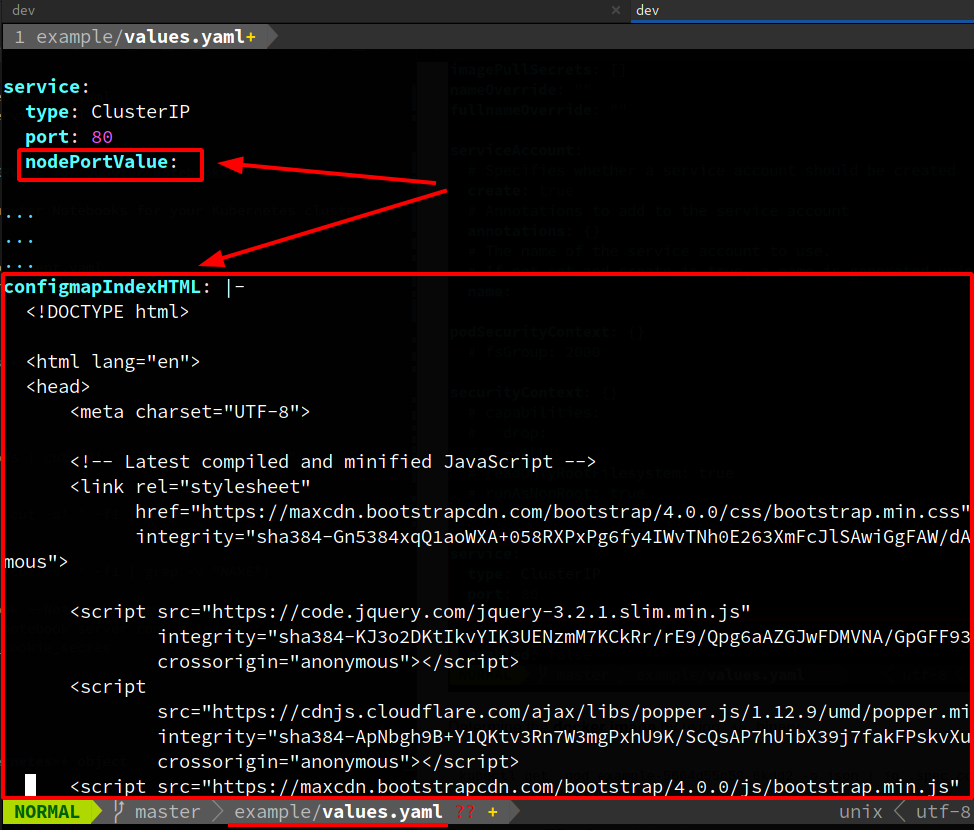

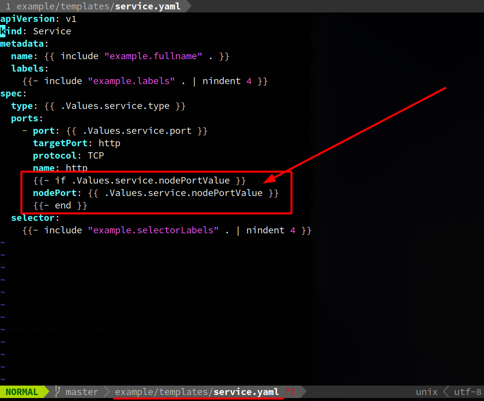

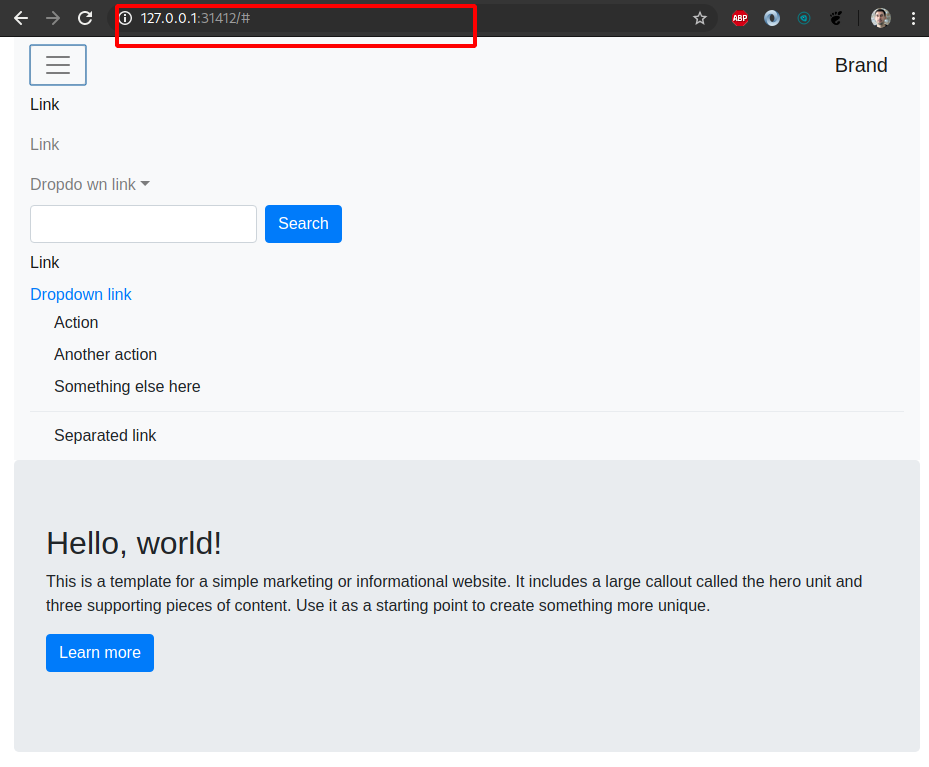


Do some **modification** to `example` helm chart
* example/values.yaml
* example/templates/service.yaml
* example/templates/deployment.yaml

Create this **new file**
* example/templates/configmapIndexHTML.yaml

**Execute** helm deployment
```bash
helm3 install example helm-charts/example \
--set service.type=NodePort \
--set service.nodePortValue=31412

# Create SSH tunnel to avoid opening
# of an extra nodePort: 31412
ssh -L31412:127.0.0.1:31412 \
-i ~/.ssh/udemy_devopsinuse \
admin@18.184.212.193
```

### 22. Explore example helm chart

Try to **close SSH tunnel**
```
ssh -L31412:127.0.0.1:31412 \
-i ~/.ssh/udemy_devopsinuse \
admin@18.184.212.193
```

**Determine** the IP addresses/names/roles of your physical EC2 instances (servers) in AWS
```bash
kubectl get nodes -o wide | awk -F" " '{print $3"\t"$1"\t"$7}'
ROLES	NAME	EXTERNAL-IP
master	ip-172-20-34-241.eu-central-1.compute.internal	18.184.212.193
node	ip-172-20-50-50.eu-central-1.compute.internal	3.120.179.150
node	ip-172-20-52-232.eu-central-1.compute.internal	18.196.157.47
```


List all deployments
```bash
helm3 ls -A
```

Before **upgrade**


Do some changes in `example/values.yaml` file in **HTML section**
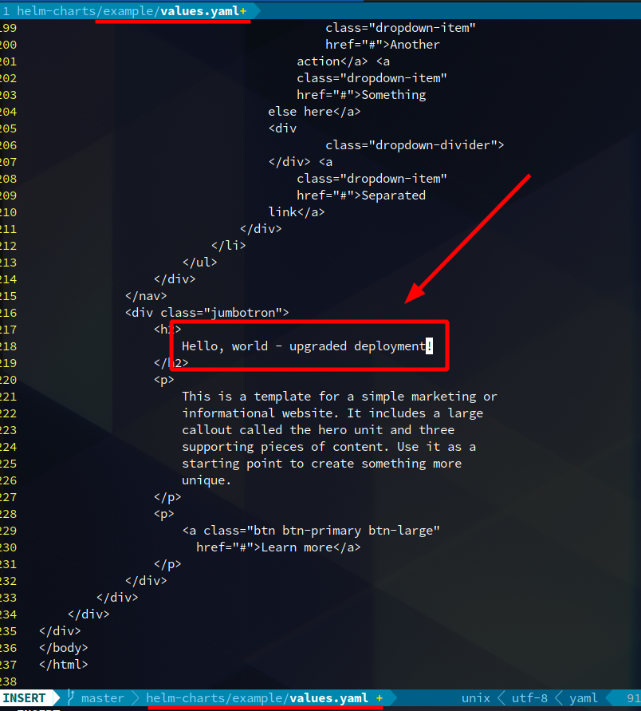

**Upgrade** deployment
```bash
helm3 upgrade example helm-charts/example \
--set service.type=NodePort \
--set service.nodePortValue=31412
```

Explore **configmap** for `example` helm chart
```bash
kubectl get cm example -o yaml
apiVersion: v1
data:
  index.html: "<!DOCTYPE html>\n\n<html lang=\"en\">\n<head>\n   ...             </p>\n            </div>\n        </div>\n    </div>\n</div>\n</body>\n</html>"
kind: ConfigMap
metadata:
  creationTimestamp: "2020-04-03T19:21:26Z"
  labels:
    app.kubernetes.io/instance: example
    app.kubernetes.io/managed-by: Helm
    app.kubernetes.io/name: example
    app.kubernetes.io/version: 1.16.0
    helm.sh/chart: example-0.1.0
  name: example
  namespace: default
  resourceVersion: "398879"
  selfLink: /api/v1/namespaces/default/configmaps/example
  uid: b2e95666-8e4b-4ca5-a8ea-60fe3cc3e6fb
```

**Delete Nginx pod** to load new content from **updated configmap**
```bash
kubectl delete pod example-7cb6767455-f84p6
```

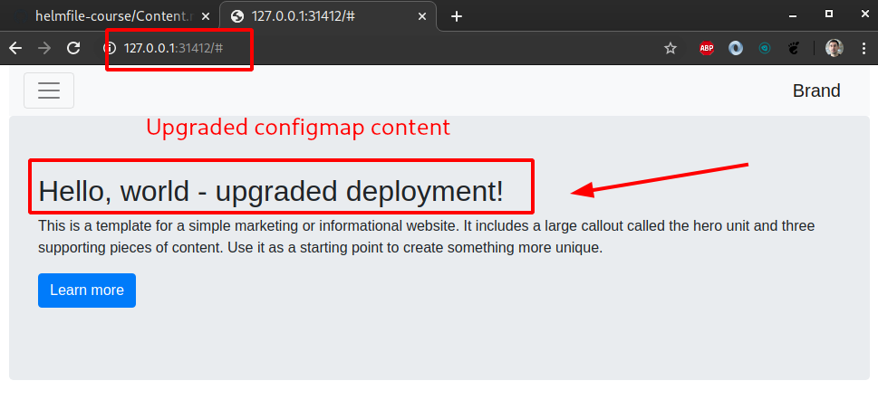

Delete **helm chart** `example` deployment
```bash
helm3 delete example
```


### 23. Deploy Gogs helm chart to a Kubernetes cluster running in AWS

It will work the same way even with **Helm version 2** 

```bash
helm3 list -A

helm3 repo add incubator \
https://kubernetes-charts-incubator.storage.googleapis.com/

helm3 repo update
helm3 repo list
helm3 search repo incubator/gogs
helm3 fetch  incubator/gogs --untar
cd gogs/
```      
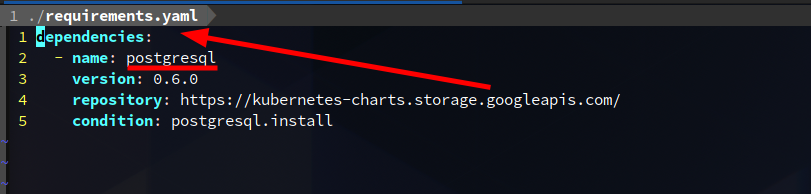

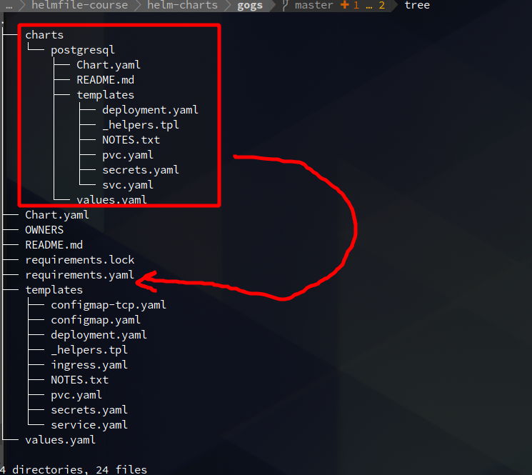


```bash
# optional
helm3 dependency update
 
sed -i.bak 's@apiVersion: extensions/v1beta1@apiVersion: apps/v1@' templates/deployment.yaml charts/postgresql/templates/deployment.yaml
sed -i.bak '/^\s*kind:\s*Deployment/,/^\s*template/s/^\(\s*spec:\s*\)/\1 \n  selector:\n    matchLabels:\n      app: {‌{ template "fullname" . }}/' charts/postgresql/templates/deployment.yaml 

# Optional - if you do not want to enable peristent volume
sed -i.bak 's/^\(\s*enabled:\s\)\(.*\)/\1false/' values.yaml

# you can see that three files have been updated
find . -type f -iname "*.bak"
./templates/deployment.yaml.bak
./values.yaml.bak
./charts/postgresql/templates/deployment.yaml.bak
```
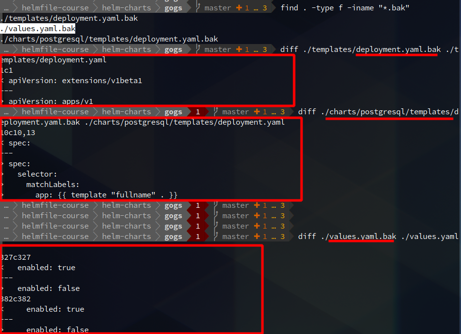

I have special requirement when it comes to **NodePort values** for:
* HTTP 30222
* SSH  30111

**Reason** is being that I do not want Kubernetes to generate them automatically - rather - I want to specify them Cause I can open firewall up front. That's why I passed two extra flags as you can see down below.


```bash
helm3 install test \
--set service.httpNodePort=30222 \
--set service.sshNodePort=30111 .

ssh -L30222:127.0.0.1:30222 \
-i ~/.ssh/udemy_devopsinuse admin@18.184.212.193
```      
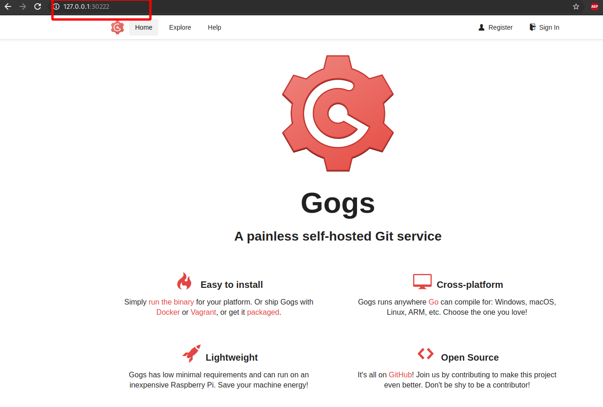


### 24. Create your own git repository at self-hosted Gogs in your Kubernetes cluster

At first you need to **register yourself** to Gogs running in Kubernetes in AWS
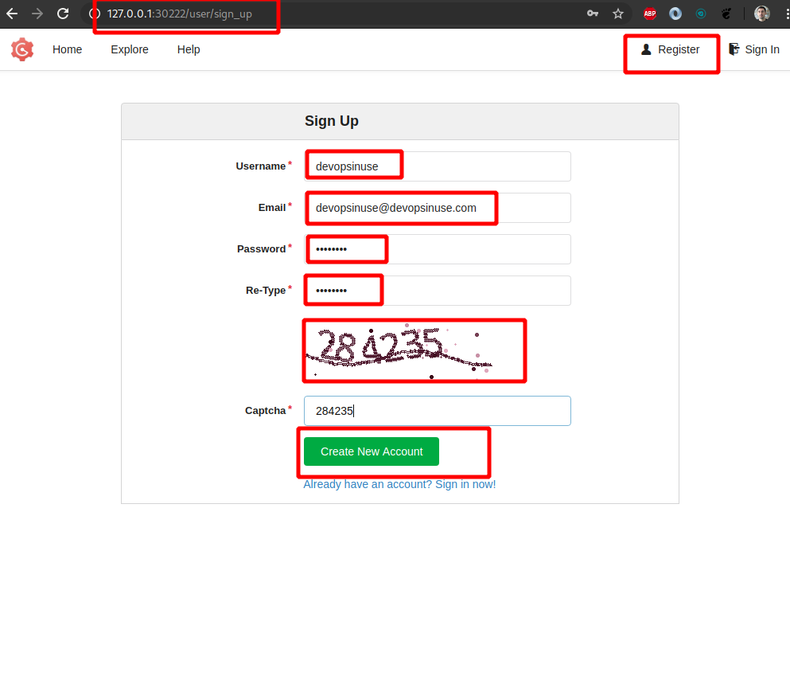

**Login with** a newly created `username/password` running in Kubernetes in AWS
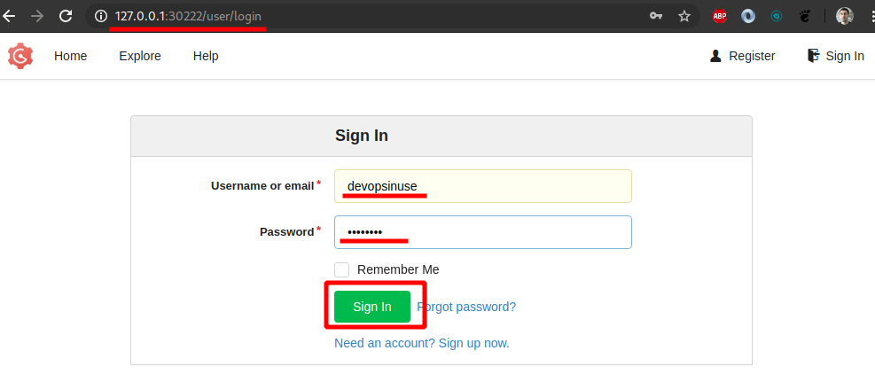


**Create** a git repository withing **your gogs account** running in Kubernetes in AWS
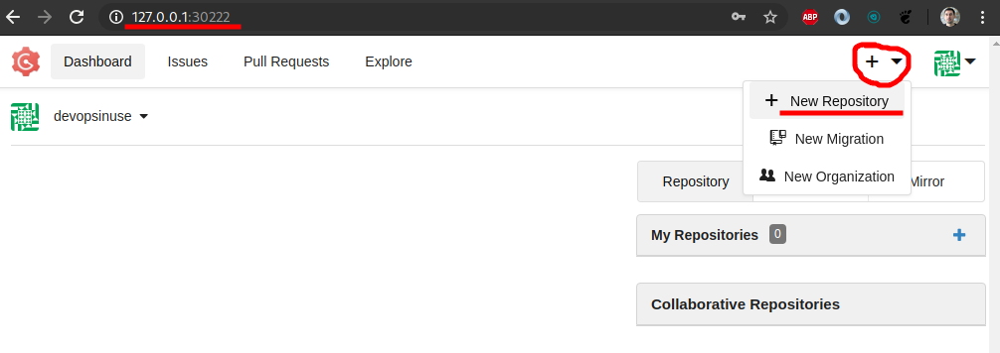

**Fill up some details** about your git repository at **self hosted gogs** running in Kubernetes in AWS
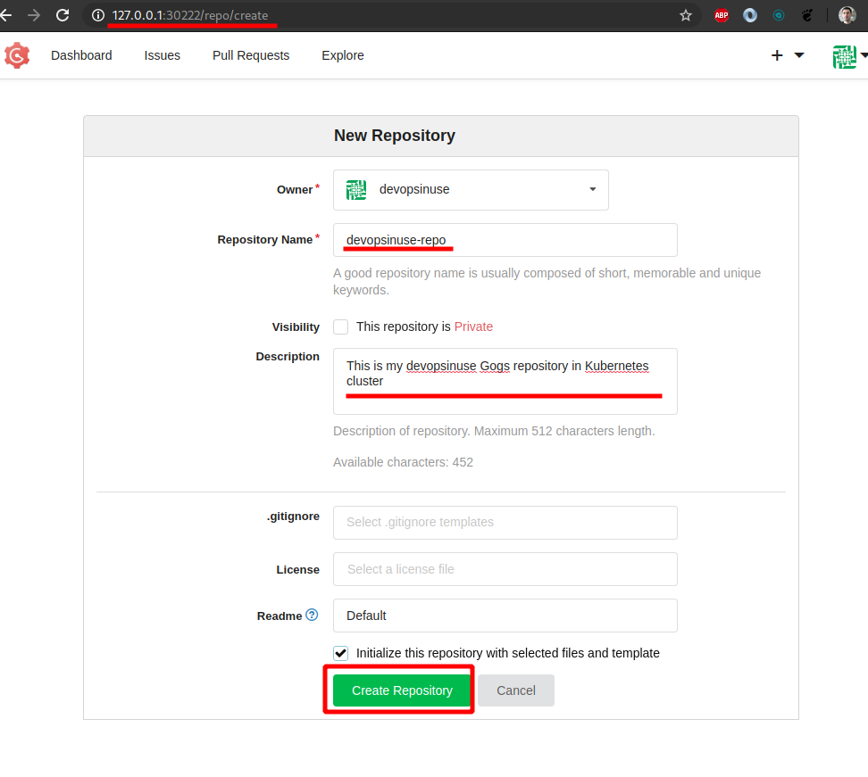

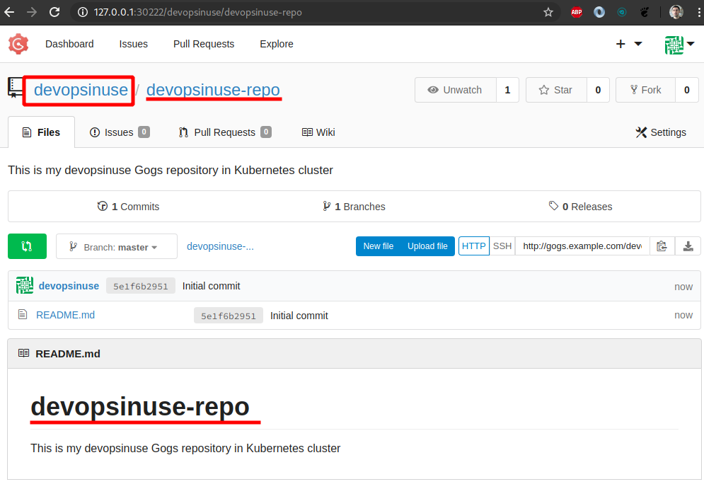


### 25. Clone your git repository devopsinuse-repo from self-hosted Gogs in your Kubernetes cluster


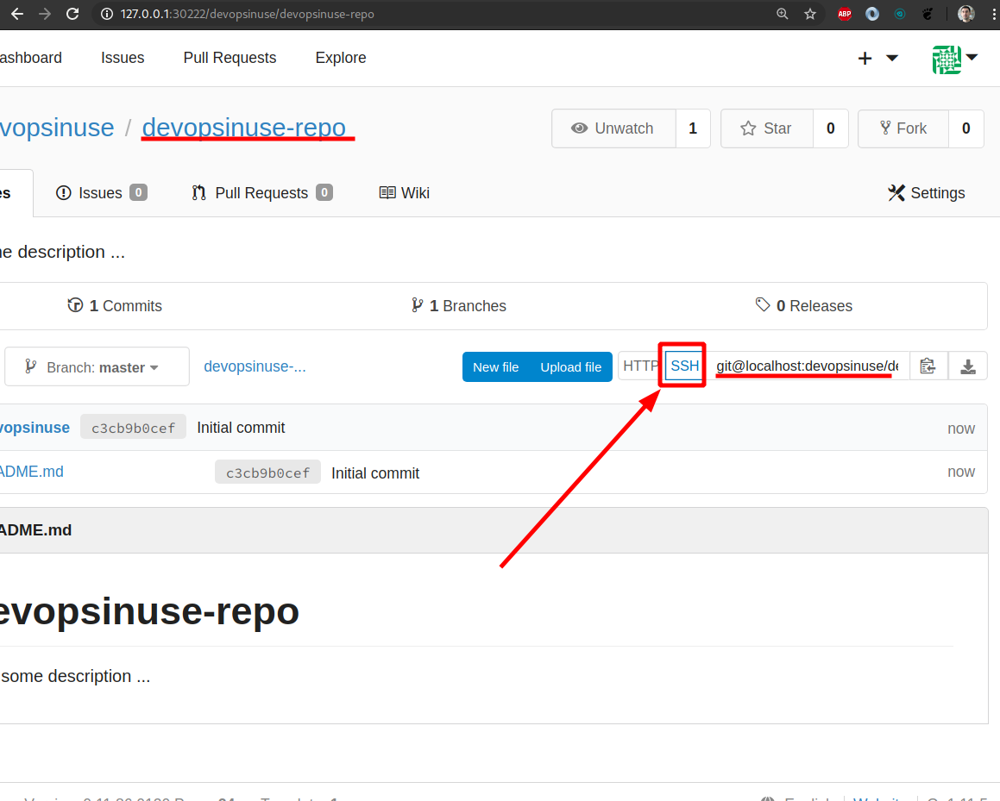
**Original SSH link** copied from web browser
```bash
git@localhost:devopsinuse/devopsinuse-repo.git
```

**Adjust** your SSH URL accordingly
```bash
ssh://git@127.0.0.1:30111/devopsinuse/devopsinuse-repo.git

# open up a new SSH tunnel for port 30111
ssh -L30111:127.0.0.1:30111 \
-i ~/.ssh/udemy_devopsinuse admin@18.184.212.193
```
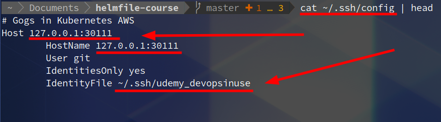


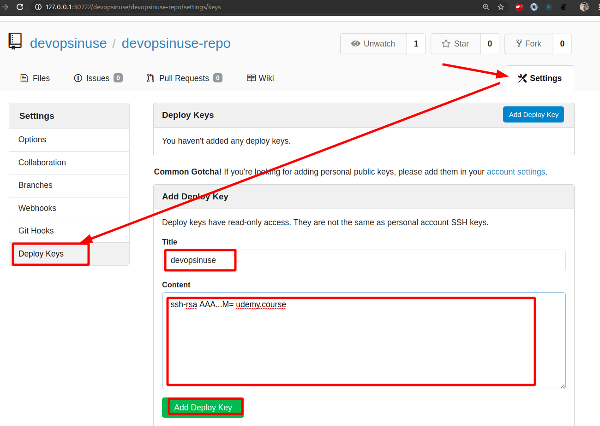

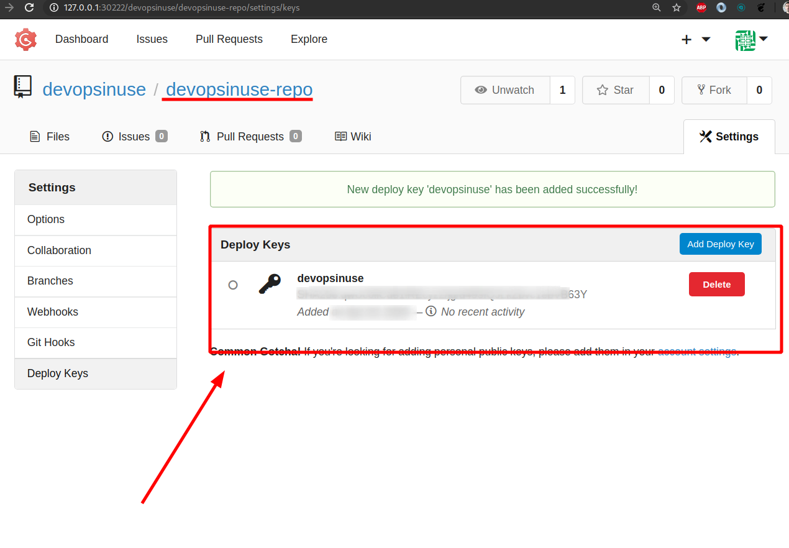
**Clone your git via SSH** project/repository from self-hosted Gogs in your Kubernetes cluster
```bash
git clone ssh://git@127.0.0.1:30111/devopsinuse/devopsinuse-repo.git
```

**Clone your git via HTTP** project/repository from self-hosted Gogs in your Kubernetes cluster
```bash
git clone http://127.0.0.1:30222/devopsinuse/devopsinuse-repo.git
```

### 26. Add some content to devopsinuse-repo and git push to your self-hosted Gogs running in Kubernetes
<!-- 26-Add-some-content-to-devopsinuse-repo-and-git-push-to-your-self-hosted-Gogs-running-in-Kubernetes.mp4 -->
**Clone** your project first if you did not do so yet

```bash

# via SSH
git clone ssh://git@127.0.0.1:30111/devopsinuse/devopsinuse-repo.git

# via HTTP
git clone http://127.0.0.1:30222/devopsinuse/devopsinuse-repo.git

cd devopsinuse-repo
git status
git remote -v
touch file{1..4}.txt
git status
git add .
git config --global user.email "devopsinuse@devopsinuse.com"
git config --global user.name "Devopsinuse"
git commit -m "Creating four files"
git push 
git push origin master
```
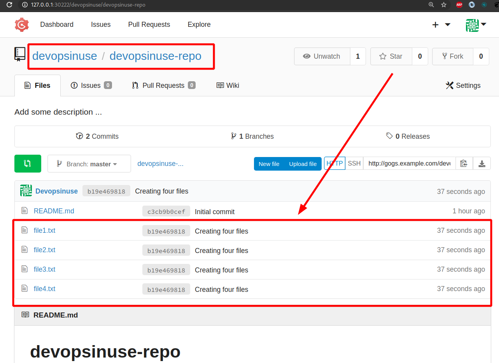

<!-- - [27. Allow NodePort in AWS Security Group section manually in case you like it more](#27-allow-nodeport-in-aws-security-group-section-manually-in-case-you-like-it-more)-->
### 27. Allow NodePort in AWS Security Group section manually in case you like it more

  

```bash
# open up a new HTTP tunnel for port 30222
ssh -L30222:127.0.0.1:30222 \
-i ~/.ssh/udemy_devopsinuse admin@18.184.212.193

# open up a new SSH tunnel for port 30111
ssh -L30111:127.0.0.1:30111 \
-i ~/.ssh/udemy_devopsinuse admin@18.184.212.193

# Create SSH tunnel to avoid opening
# of an extra nodePort: 31412 for "example" helm chart
ssh -L31412:127.0.0.1:31412 \
-i ~/.ssh/udemy_devopsinuse \
admin@18.184.212.193
```

**In case** you like to set up `NodePorts` for your Kubernetes deploymnt better in AWS web console in the section of **Security group** feel free to do so. In such a case you can skip pretty much **all SSH tunnels** and instead please us one of the **IP Addresses** of your `Kubenretes nodes`.

To **retrieve IP Addresses** of your physical EC2 instances within your Kubenretes cluster - run this command:

```bash
kubectl get nodes -o wide | awk -F" " '{print $3"\t"$1"\t"$7}'
ROLES	NAME	EXTERNAL-IP
master	ip-172-20-34-241.eu-central-1.compute.internal	18.184.212.193
node	ip-172-20-50-50.eu-central-1.compute.internal	3.120.179.150
node	ip-172-20-52-232.eu-central-1.compute.internal	18.196.157.47

```

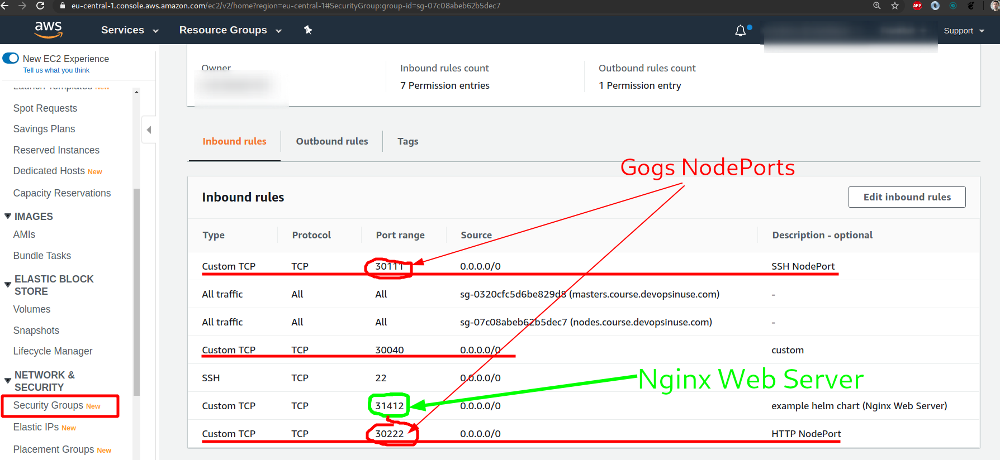

### 28. MySQL helm chart deployment with Persistent Volume


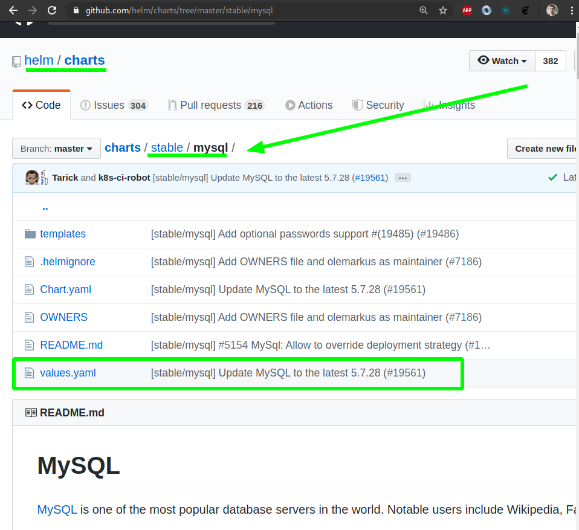

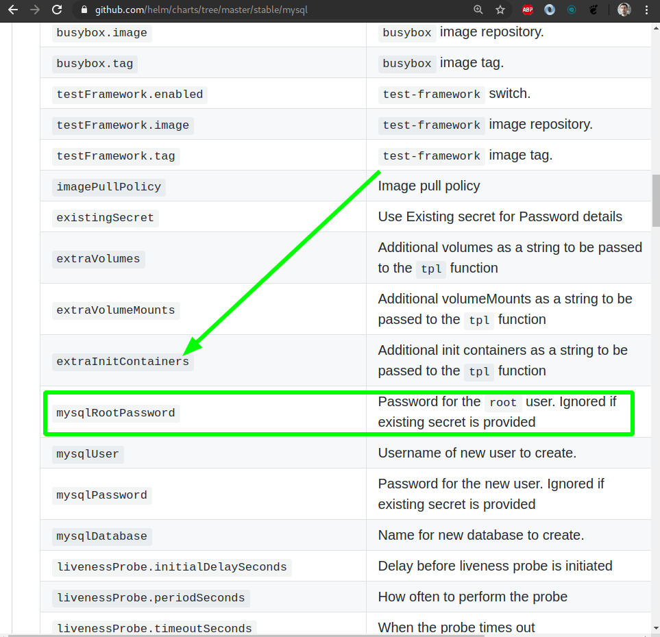

Search for MySQL helm chart (helm v3):
```bash
helm3 repo list                          
NAME     	URL                                                        
stable   	https://kubernetes-charts.storage.googleapis.com/          
incubator	https://kubernetes-charts-incubator.storage.googleapis.com/

helm3 search repo stable/mysql -l | head 
NAME            	CHART VERSION	APP VERSION	DESCRIPTION                                       
stable/mysql    	1.6.2        	5.7.28     	Fast, reliable, scalable, and easy to use open-..
```

Try to use `helm3 template` command to see what you are about to be deploying to your Kubernetes cluster in AWS

```bash
# template your mysql helm chart 
# before you going to deploy it to Kubenretes cluster
helm3 template \
mysql \
--set persistence.enabled=true \
--set persistence.size=1Gi \
--set mysqlRootPassword=Start123 \
stable/mysql | less
```

Deploy **MySQL helm chart** from a **"stable"** helm chart repository

```bash
helm3 install \
mysql \
--set persistence.enabled=true \
--set persistence.size=1Gi \
--set mysqlRootPassword=Start123 \
stable/mysql 

...

To get your root password run:

    MYSQL_ROOT_PASSWORD=$(kubectl get secret --namespace default mysql -o jsonpath="{.data.mysql-root-password}" | base64 --decode; echo)

To connect to your database:

1. Run an Ubuntu pod that you can use as a client:

    kubectl run -i --tty ubuntu --image=ubuntu:16.04 --restart=Never -- bash -il

2. Install the mysql client:

    $ apt-get update && apt-get install mysql-client -y

3. Connect using the mysql cli, then provide your password:
    $ mysql -h mysql -p

To connect to your database directly from outside the K8s cluster:
    MYSQL_HOST=127.0.0.1
    MYSQL_PORT=3306

    # Execute the following command to route the connection:
    kubectl port-forward svc/mysql 3306

    mysql -h ${MYSQL_HOST} -P${MYSQL_PORT} -u root -p${MYSQL_ROOT_PASSWORD}

```


```bash
aws ec2 describe-volumes --profile terraform | jq .Volumes | jq '.[].Tags'

...
[
  {
    "Key": "kubernetes.io/created-for/pv/name",
    "Value": "pvc-1b0192ec-8504-4742-9e78-fbae63a7a1e3"
  },
  {
    "Key": "kubernetes.io/created-for/pvc/name",
    "Value": "mysql"
  },
  {
    "Key": "kubernetes.io/cluster/course.devopsinuse.com",
    "Value": "owned"
  },
  {
    "Key": "KubernetesCluster",
    "Value": "course.devopsinuse.com"
  },
  {
    "Key": "Name",
    "Value": "course.devopsinuse.com-dynamic-pvc-1b0192ec-8504-4742-9e78-fbae63a7a1e3"
  },
  {
    "Key": "kubernetes.io/created-for/pvc/namespace",
    "Value": "default"
  }
]

```


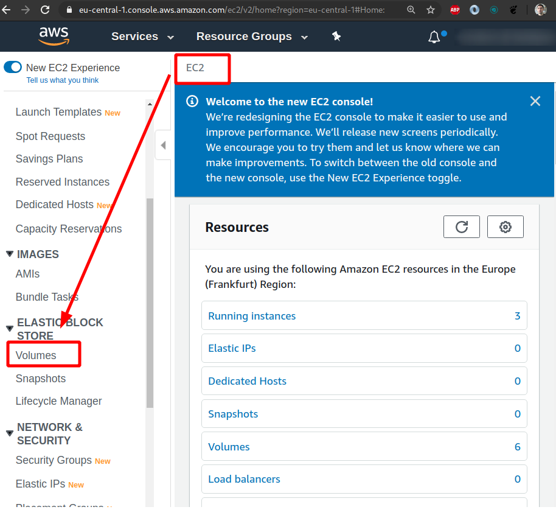

Please check that one **persistent volume has been crerated in your Kubenretes cluster** as well as in **your AWS console**.

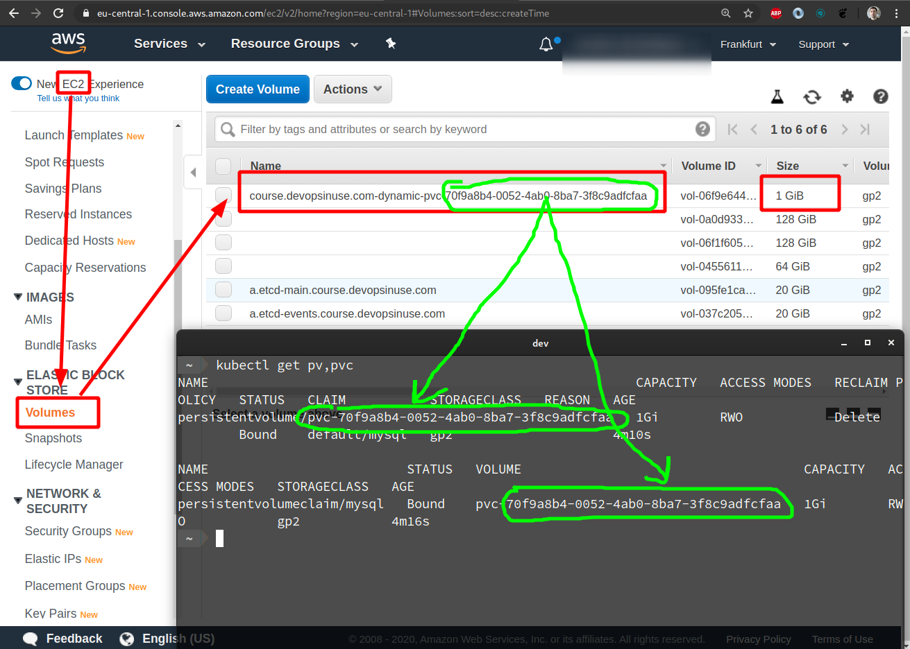

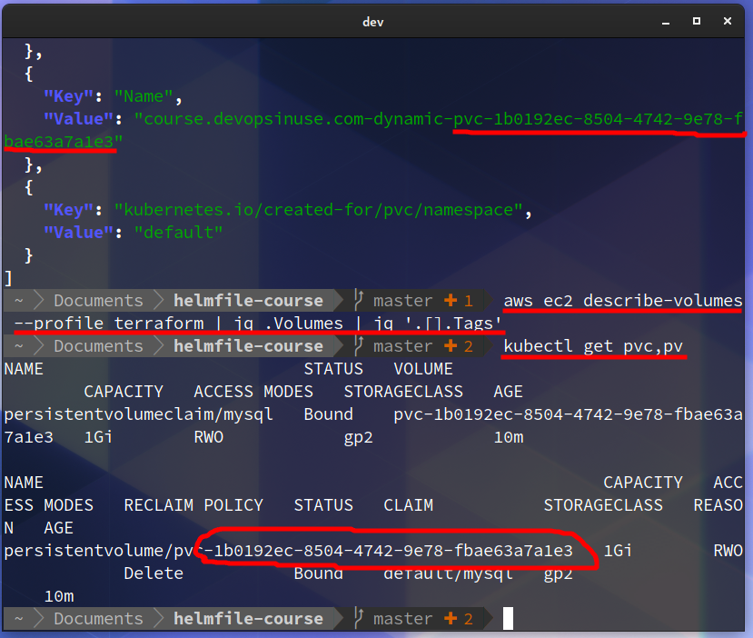

### 29. Connect to your MySQL deployment running in your Kubernetes cluster in AWS via an extra ubuntu pod

To get your **root password run**:

    MYSQL_ROOT_PASSWORD=$(kubectl get secret --namespace default mysql -o jsonpath="{.data.mysql-root-password}" | base64 --decode; echo)

To **connect to your database**:

1. Run an **Ubuntu pod** that you can use as a client:

    kubectl run -i --tty ubuntu --image=ubuntu:16.04 --restart=Never -- bash -il

2. Install the **mysql client**:

    $ apt-get update && apt-get install mysql-client -y

3. **Connect using the mysql cli**, then provide your password:
```bash
    $ mysql -h mysql -p
    $ create database devopsinuse;
```

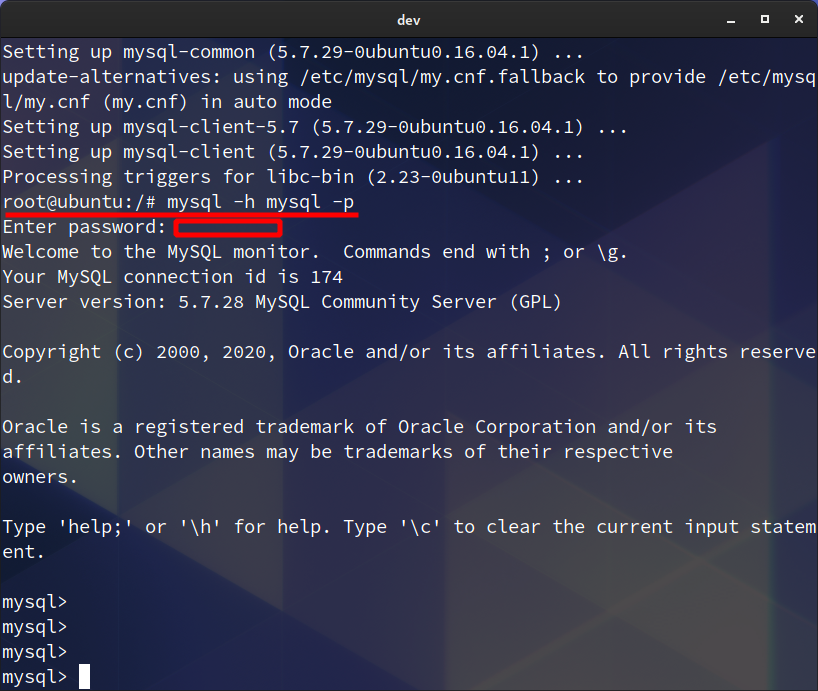

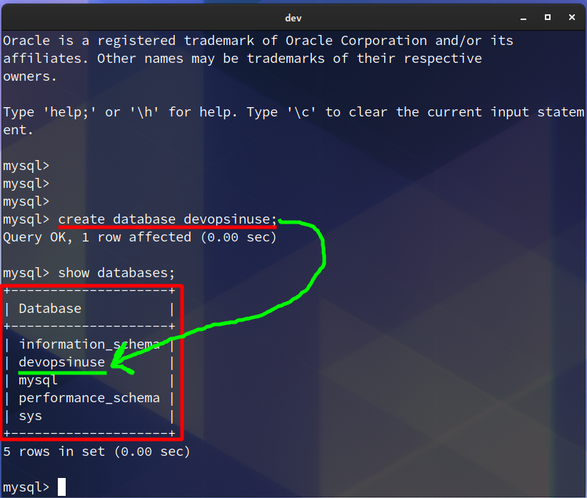

### 30. Connect to your MySQL deployment running in your Kubernetes cluster in AWS via dbeaver or your favourite GUI program

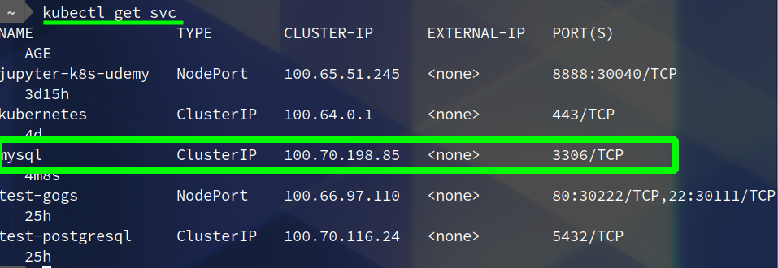

**Upgrade your MySQL** deployment and add NodePort type of Kubernetes service and set `nodePort` value to 30333

```bash
helm3 template mysql stable/mysql \
--set mysqlRootPassword=Start123 \
--set persistence.enabled=true \
--set persistence.size=1Gi \
--set service.type=NodePort \
--set service.nodePort=30333 | less

helm3 upgrade mysql stable/mysql \
--set mysqlRootPassword=Start123 \
--set persistence.enabled=true \
--set persistence.size=1Gi \
--set service.type=NodePort \
--set service.nodePort=30333 
```
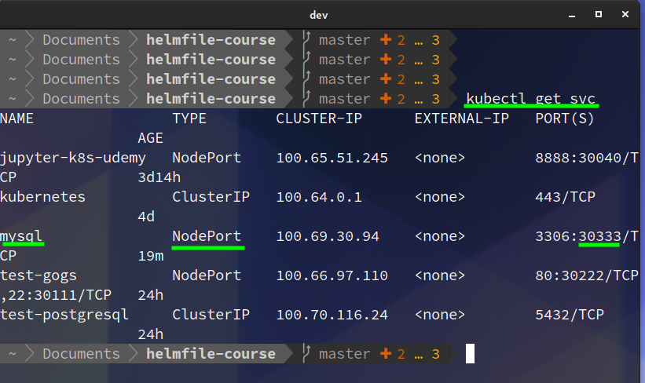
**Setup SSH tunnel** to MySQL NodePort 20333

```bash
ssh -L30333:127.0.0.1:30333 \
-i ~/.ssh/udemy_devopsinuse \
admin@18.184.212.193
```
**If this** is more convinient way to setup **Security Group** for your Kubenretes nodes - please see image below:
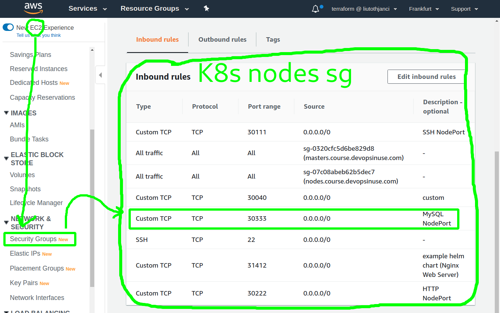

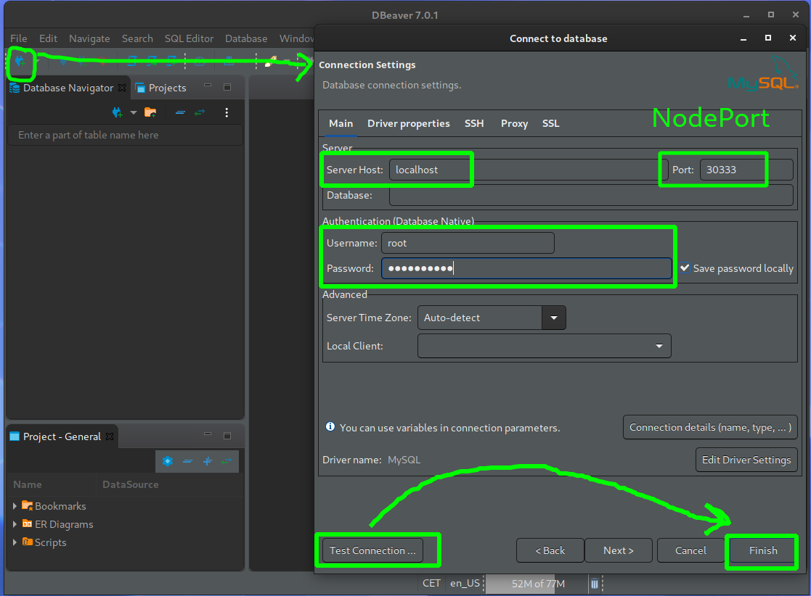

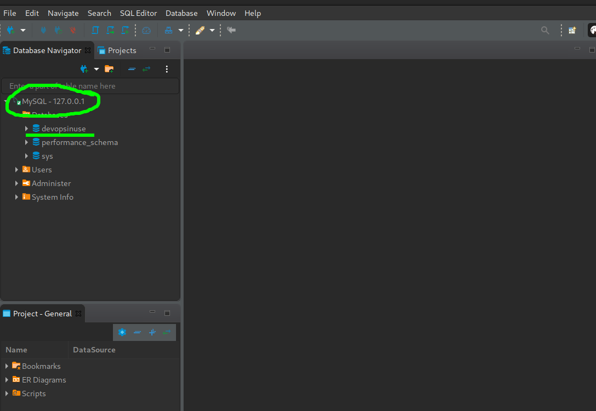

To **delete mysql helm chart** deployment from a Kubernetes cluster in AW
```bash
helm3 delete mysql
```


<!-- Section Helmfile -->

<!-- - [31. Deploy example and gogs helm charts via helmfile binary from a local filesystem to your Kubernetes cluster in AWS](#31-deploy-example-and-gogs-helm-charts-via-helmfile-binary-from-a-local-filesystem-to-your-kubernetes-cluster-in-aws)-->
### 31. Deploy example and gogs helm charts via helmfile binary from a local filesystem to your Kubernetes cluster in AWS

**Install helmfile** if you have not done so

```bash
sudo curl -L --output /usr/bin/helmfile https://github.com/roboll/helmfile/releases/download/v0.104.0/helmfile_linux_amd64
sudo chmod +x /usr/bin/helmfile

# Create symbolic link from helm3 to helm
ln -s /usr/local/bin/helm3 /usr/bin/helm
```

**Define your helmfile** specification for **"example"** helm chart deployment to your Kubernetes cluster file: `helmfiles/helmfile-for-example-and-gogs-helm-charts.yaml`

```yaml
repositories:
# To use official "stable" charts 
- name: stable
  url: https://kubernetes-charts.storage.googleapis.com

# Export your environment e.g "learning", "dev", ..., "prod"
# export HELMFILE_ENVIRONMENT="learning"

environments:
  {{ requiredEnv "HELMFILE_ENVIRONMENT" }}:
    values:
      - values.yaml

releases:
  # "example" helm chart release specification  
  - name: example
    labels:
      key: example
      app: nginx

    chart: ../helm-charts/example
    version: 0.1.0
    set:
    - name: service.type
      value: NodePort
    - name: service.nodePortValue
      value: 31412
  
  # "Gogs" helm chart release specification  
  - name: test
    labels:
      key: gogs
      app: gogs

    chart: ../helm-charts/gogs
    version: 0.7.11
    set:
    - name: service.httpNodePort
      value: 30222
    - name: service.sshNodePort
      value: 30111
```

**Compare** it with an original `helm3` command used to deploy "example"  helm chart to your Kubernetes cluster in AWS

```bash
# Example helm chart (Nginx Web Server)
helm3 install example helm-charts/example \
--set service.type=NodePort \
--set service.nodePortValue=31412

# Gogs helm chart
helm3 install test \
--set service.httpNodePort=30222 \
--set service.sshNodePort=30111 .
```

**Do not forget** to create SSH tunnel to open up **NodePort values**

```bash
# Create SSH tunnel to avoid opening
# of an extra nodePorts: 
#     - 31412 (Nginx Web server)
#     - 30111 (SSH)
#     - 30222 (HTTP)

ssh \
-L31412:127.0.0.1:31412 \
-L30111:127.0.0.1:30111 \
-L30222:127.0.0.1:30222 \
-i ~/.ssh/udemy_devopsinuse \
admin@18.184.212.193
```

**Alternatively** you can allow this port 31412 in **"Security group"** section in your AWS console


**Explore helmfile** `template command` for **"example"** helm chart deployment

```bash
# template "example" helm chart via helmfile

export HELMFILE_ENVIRONMENT="learning"
# template without usig --selector flag
helmfile \
--environment learning \
--file helmfiles/helmfile-for-example-and-gogs-helm-charts.yaml template | less

# template "example" helm chart via helmfile using  --selector flag
helmfile \
--environment learning \
--selector key=example \
--file helmfiles/helmfile-for-example-and-gogs-helm-charts.yaml template | less

# template "example" helm chart via helmfile using  --selector flag 
helmfile \
--environment learning \
--selector app=nginx \
--file helmfiles/helmfile-for-example-and-gogs-helm-charts.yaml template | less

# template "Gogs" helm chart via helmfile using  --selector flag
helmfile \
--environment learning \
--selector key=gogs \
--file helmfiles/helmfile-for-example-and-gogs-helm-charts.yaml template | less

# template "Gogs" helm chart via helmfile using  --selector flag
helmfile \
--environment learning \
--selector app=gogs \
--file helmfiles/helmfile-for-example-and-gogs-helm-charts.yaml template | less


```

**Please check current releases** deployed in your Kubernetes cluster in AWS

```bash
helm3 ls -A
```

Deploy **"example"**  and **"gogs"** helm charts via `helmfile` to your Kubernetes cluster in AWS

```bash
export HELMFILE_ENVIRONMENT="learning"
# deploy without usig --selector flag
helmfile \
--environment learning \
--file helmfiles/helmfile-for-example-and-gogs-helm-charts.yaml sync

# deploy "example" helm chart via helmfile using  --selector flag
helmfile \
--environment learning \
--selector key=example \
--file helmfiles/helmfile-for-example-and-gogs-helm-charts.yaml sync

# deploy "example" helm chart via helmfile using  --selector flag
helmfile \
--environment learning \
--selector app=nginx \
--file helmfiles/helmfile-for-example-and-gogs-helm-charts.yaml sync

# deploy "Gogs" helm chart via helmfile using  --selector flag
helmfile \
--environment learning \
--selector key=gogs \
--file helmfiles/helmfile-for-example-and-gogs-helm-charts.yaml sync

# deploy "Gogs" helm chart via helmfile using  --selector flag
helmfile \
--environment learning \
--selector app=gogs \
--file helmfiles/helmfile-for-example-and-gogs-helm-charts.yaml sync
```

Destroy **"example"** and **"gogs"** helm charts via `helmfile` from your Kubernetes cluster in AWS

```bash
export HELMFILE_ENVIRONMENT="learning"
# destroy all without usig --selector flag 
helmfile \
--environment learning \
--file helmfiles/helmfile-for-example-and-gogs-helm-charts.yaml destroy

# destroy "example" helm chart via helmfile using  --selector flag 
helmfile \
--environment learning \
--selector key=example \
--file helmfiles/helmfile-for-example-and-gogs-helm-charts.yaml destroy

# destroy "example" helm chart via helmfile using  --selector flag 
helmfile \
--environment learning \
--selector app=nginx \
--file helmfiles/helmfile-for-example-and-gogs-helm-charts.yaml destroy

# destroy "Gogs" helm chart via helmfile using  --selector flag
helmfile \
--environment learning \
--selector key=gogs \
--file helmfiles/helmfile-for-example-and-gogs-helm-charts.yaml destroy

# destroy "Gogs" helm chart via helmfile using  --selector flag
helmfile \
--environment learning \
--selector app=gogs \
--file helmfiles/helmfile-for-example-and-gogs-helm-charts.yaml destroy


```


<!-- - [32. Deploy MySQL helm chart from stable helm chart repository to your Kubernetes cluster running in AWS](#32-deploy-mysql-helm-chart-from-stable-helm-chart-repository-to-your-kubernetes-cluster-running-in-aws)-->
### 32. Deploy MySQL helm chart from stable helm chart repository to your Kubernetes cluster running in AWS

Explore `helmfiles/helmfile-for-mysql-helm-chart.yaml` helmfile for MySQL deployment to Kubernetes

```yaml
repositories:
# To use official "stable" charts 
- name: stable
  url: https://kubernetes-charts.storage.googleapis.com

# Export your environment e.g "learning", "dev", ..., "prod"
# export HELMFILE_ENVIRONMENT="learning"

environments:
  {{ requiredEnv "HELMFILE_ENVIRONMENT" }}:
    values:
      - values.yaml

releases:
  # "example" helm chart release specification  
  - name: mysql
    labels:
      key: database
      app: mysql

    chart: stable/mysql
    version: 1.6.2
    set:
    - name: service.type
      value: NodePort
    - name: service.nodePortValue
      value: 30333
    - name: mysqlRootPassword
      value: Start123
    - name: persistence.enabled
      value: true
    - name: persistence.size
      value: 1Gi

```

**Compare** it with an original `helm3` command used to deploy **“mysql”** helm chart to your Kubernetes cluster in AWS

```bash
helm3 install mysql stable/mysql \
--set mysqlRootPassword=Start123 \
--set persistence.enabled=true \
--set persistence.size=1Gi \
--set service.type=NodePort \
--set service.nodePort=30333 
```
**Establish** SSH tunnel to open up NodePort value for MySQL

```bash
# Create SSH tunnel to avoid opening
# of an extra nodePorts: 
#     - 30333 (MySQL)

ssh \
-L31412:127.0.0.1:30333 \
-i ~/.ssh/udemy_devopsinuse \
admin@18.184.212.193
```
**You can allow** this port 30333 in **“Security group”** section in your AWS console


### 33. Create helm chart repository at your Github account 

**Create** `helm v3` helm chart repository at your Github repository
```bash
git clone https://github.com/xjantoth/helmfile-course.git

cd helmfile-course
mkdir -p docs/hc-v3-repo

helm3 search repo stable/jenkins -l | head -n 2  
NAME          	CHART VERSION	APP VERSION	DESCRIPTION                                       
stable/jenkins	1.11.3       	lts        	Open source continuous integration server. It s...

helm3 fetch stable/jenkins --destination docs/hc-v3-repo/

git add docs/hc-v3-repo
git commit -m "Creating helm v3 chart repository docs/hc-v3-repo"
git push 
```
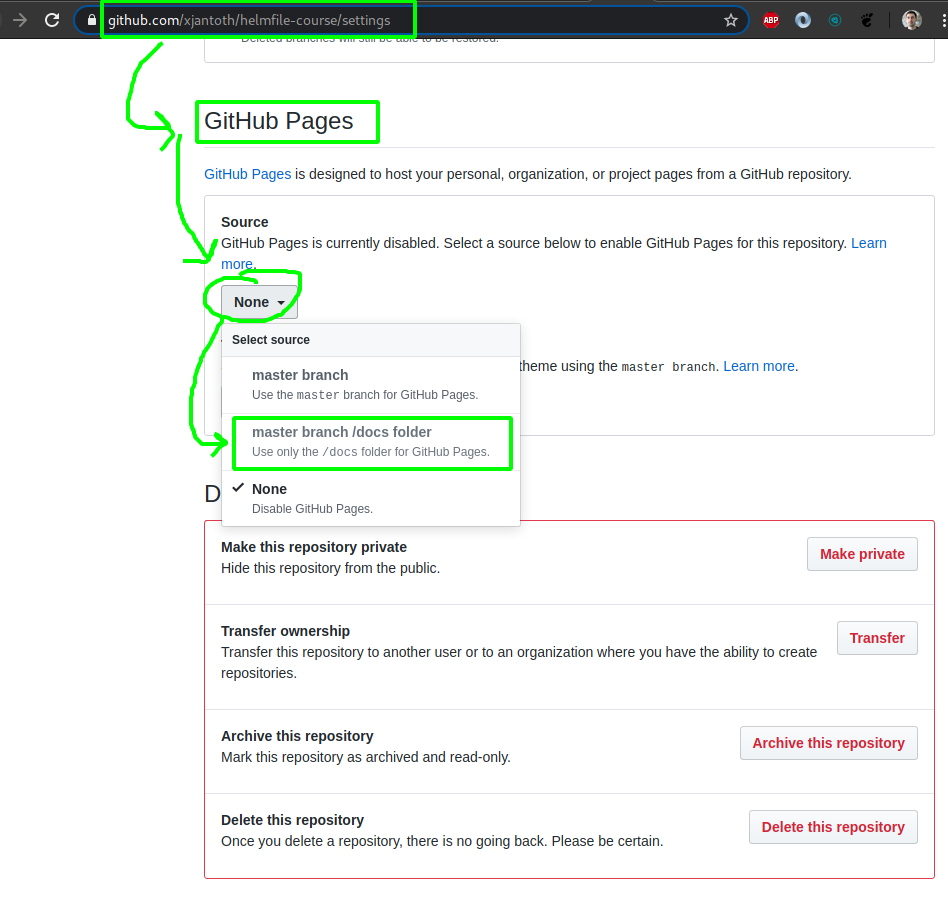

```bash
helm3 repo add hc-v3-repo https://xjantoth.github.io/microservice/hc-v3-repo
helm3 repo update
helm3 repo list
helm3 search repo hc-v3-repo/ 
```


